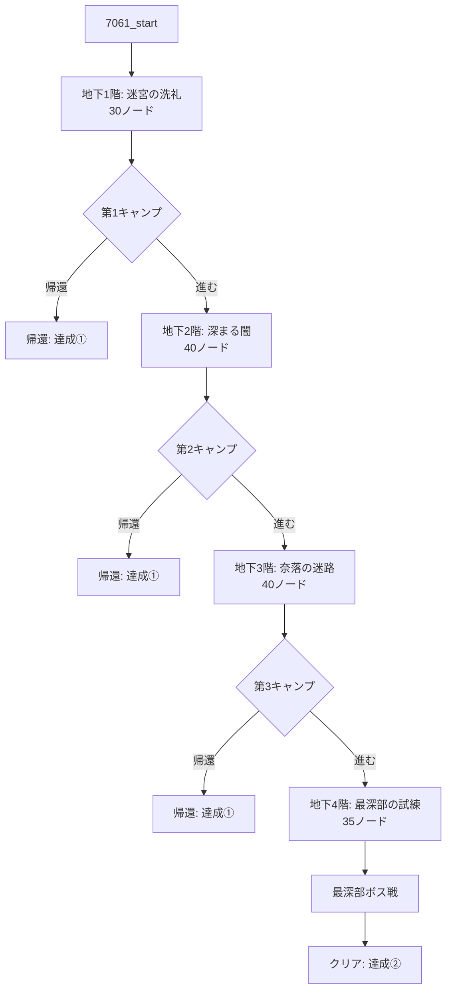

# 個別仕様書：「狭間の迷宮・上層 (7061)」

## 1. 基本情報

| 項目 | 設定値 |
| :--- | :--- |
| **クエストID** | `7061` |
| **スラグ** | `qst_rift_upper` |
| **タイトル** | 狭間の迷宮・上層 |
| **クエスト種別** | Special |
| **推奨レベル** | 8 |
| **難易度** | 3 |
| **制限時間 (time_cost)** | 成功時: 6日 / 失敗時: 4日 |
| **出現条件** | 「狭間の迷宮・プロローグ (7060)」をクリアしていること |
| **リピート受注** | 可能 |
| **クリア報酬（通常）** | 経験値: 1200 / ゴールド: 600G / 名声: +15 |
| **クリア報酬（特別）** | 重要クエストアイテム「**赤の宝珠**」 (itemId: 326 / 装備部位: 装飾品 / 効果: HP+3, DEF+1) |

---

## 2. アセット定義と生成計画

上層階の専用演出および情景描写のため、以下の新規アセットを導入・定義し、実行フェーズで生成します。

### 2.1. 新規探索BGM
*   **アセットキー**: `bgm_rift_upper`
*   **ファイル名**: `public/sounds/bgm/bgm_rift_upper.mp3`
*   **演出用途**: 上層階（B1F〜B4F）の通常探索用BGM。

### 2.2. 背景画像（使い分け）
*   **`bg_rift_upper_01`**: 迷宮の上層階通路、細長い石造りの廊下、崩れかけた部屋などで使用。
*   **`bg_rift_upper_02`**: より深奥の暗い広間、不気味な青い光が漏れ出る空間、大空洞などで使用。
*   **`bg_rift_entrance`**: クエスト開始時の迷宮入り口ノードのみで使用。
*   **`bg_rift_camp`**: 各階の境界にある安全なキャンプ地ノードで使用。
*   **`bg_rift_maze`**: 最深部（B4F）のボス部屋で使用。

### 2.3. 前景レイヤー画像 (Sprites - 既存・新規精査)
*   **`fg_rift_chest`**: 宝箱発見時に背景の上に重ねて表示（※透過背景版に再生成）。
*   **`fg_rift_merchant`**: 怪しい商人とのエンカウント時に重ねて表示（※透過背景版に再生成）。
*   **`fg_rift_well` (新規)**: 古井戸ノードで使用。 (`public/images/quests/fg_rift_well.png`)
*   **`fg_rift_spring` (新規)**: 湧き水の泉ノードで使用。 (`public/images/quests/fg_rift_spring.png`)
*   **`fg_rift_trap_spears` (新規)**: 槍トラップ作動時のアニメーションレイヤー。 (`public/images/quests/fg_rift_trap_spears.png`)
*   **`fg_rift_door_basic` (新規)**: 通常の木製の扉の演出用レイヤー画像。 (`public/images/quests/fg_rift_door_basic.png`)
*   **`fg_rift_door_iron` (新規・扉精査)**: 地下1階等の「迷宮の鉄格子の扉」の演出用レイヤー画像。黒い錆びついた鉄製の格子扉のビジュアル。 (`public/images/quests/fg_rift_door_iron.png`)
*   **`fg_rift_door_boss` (新規・扉精査)**: 地下4階ボス部屋前の「混沌の彫刻が刻まれた大扉」の演出用レイヤー画像。悲鳴を上げる死者と骸骨王の意匠が浮き彫りになった黒鉄の大扉。 (`public/images/quests/fg_rift_door_boss.png`)

---

## 3. 特殊ゲームシステム

### 3.1. キャンプシステム (計3回)
地下1階、地下2階、地下3階の最奥（階層の節目）にキャンプ地を設置します。
*   **行動選択**:
    1.  **装備変更・アイテム使用**: インベントリ画面を開き、探索で得た装備の変更やポーションでの回復が可能。
    2.  **探索を続ける**: 次の階層へ進む。
    3.  **街に帰還する (達成①)**:
        *   探索をその場で切り上げて安全に帰還。
        *   それまでに獲得した経験値やドロップアイテムはすべて持ち帰ることができますが、中層（7062）は解放されません。

### 3.2. 怪しい商人とのその場取引システム
地下2階で遭遇する怪しい商人から、画面遷移を行わずにその場で取引（購入）を行うためのロジックです。

*   **取引処理の流れ**:
    1.  プレイヤーの所持ゴールドをチェック（例: 250G以上所持しているか）。
    2.  購入選択時、フロントエンドの `questState.lootPool` に以下の両方をプッシュ。
        *   `{ itemId: "gold", quantity: -250 }` （ゴールドのマイナス値）
        *   `{ itemId: 311, quantity: 1 }` （購入するアイテム、例：妖刀「人食い」）
    3.  クエストクリア（または途中帰還）時、サーバーAPIが自動的に所持ゴールドから250Gを減算し、インベントリにアイテムを追加します。
    4.  ゴールド不足時は、購入の選択肢がグレーアウト（または「金が足りないようだ」と商人に断られるノードへ遷移）します。

---

## 4. 各フロアのノード構成とテーマ

全体で **約145〜150ノード** を構築します。

### 4.1. 地下1階：迷宮の洗礼（30ノード）
*   **テーマ**: 探索システムの実地体験。
*   **BGM**: `bgm_rift_upper`（新規）
*   **使用ビジュアル**: 
    *   背景: `bg_rift_entrance` (入り口) -> `bg_rift_upper_01` (ダンジョン内部)
    *   前景: `fg_rift_door_iron` (最初の扉の対峙で使用), `fg_rift_door_basic` (通常の木製扉で使用), `fg_rift_chest`
*   **終端**: **第1キャンプノード** (背景: `bg_rift_camp` / BGM: `bgm_quest_calm`)

### 4.2. 地下2階：深まる闇と他者の影（40ノード）
*   **テーマ**: 探索の多様化とNPCとの遭遇。
*   **BGM**: `bgm_rift_upper`（新規）
*   **使用ビジュアル**:
    *   背景: `bg_rift_upper_01` / `bg_rift_upper_02` (通路・大部屋での切り替え)
    *   前景: `fg_rift_merchant`, `fg_rift_well`
*   **終端**: **第2キャンプノード** (背景: `bg_rift_camp`)

### 4.3. 地下3階：奈落の迷路（40ノード）
*   **テーマ**: 分岐の複雑化と情景探索。
*   **BGM**: `bgm_rift_upper`（新規）
*   **使用ビジュアル**:
    *   背景: `bg_rift_upper_02` (より深奥の不気味な通路)
    *   前景: `fg_rift_spring`, `fg_rift_trap_spears`
*   **終端**: **第3キャンプノード** (背景: `bg_rift_camp`)

### 4.4. 地下4階：最深部への試練（35ノード）
*   **テーマ**: 消耗戦とボス決戦。
*   **BGM**: `bgm_rift_upper`（新規） -> ボス戦時 `bgm_battle`
*   **使用ビジュアル**:
    *   背景: `bg_rift_upper_02` -> 最深部ボス部屋: `bg_rift_maze`
    *   前景: `fg_rift_door_boss` (ボス扉との対峙で使用), `fg_rift_trap_spears`
*   **最深部ボス**: **スケルトンキング (Lv.16)** ＆ **インプ (Lv.12) × 2**
*   **クリアノード（帰還演出）**: ボス撃破後、崩れかけた祭壇から「赤の宝珠」を回収。と同時に、部屋の隅の解き放たれた大扉の奥から「地上へと続く長い上り階段」を発見し、そこから這い上がるようにして地上へ帰還。

---

## 5. 主要ノードのテキスト・パラメータ設計例

探索の臨場感・ハクスラ感を表現するための情景描写テキストと、パラメータ設計例です。

### 5.1. 特殊ギミックノード例

#### ① 古井戸ノード (地下2階)
*   **Node ID**: `7061_b2f_well`
*   **背景 / 前景**: `bg_rift_upper_01` / `fg_rift_well`
*   **テキスト**:
    > 通路の隅に、ひっそりと古びた石井戸が佇んでいる。底からはひんやりとした風が吹き抜けており、暗闇の奥で何かがかすかに光っているように見える……。
*   **選択肢**:
    1.  `井戸をのぞき込んでみる` ➔ 遷移先: `7061_b2f_well_check`
    2.  `関わらずに先を急ぐ` ➔ 遷移先: `7061_b2f_next`

*   **Node ID**: `7061_b2f_well_check` (random_branch)
    *   確率 40% で吉（`7061_b2f_well_good` / 150G獲得）、60% で凶（`7061_b2f_well_bad` / 毒・ダメージ）

#### ② 湧き水の泉ノード (地下3階)
*   **Node ID**: `7061_b3f_spring`
*   **背景 / 前景**: `bg_rift_upper_02` / `fg_rift_spring`
*   **テキスト**:
    > 静寂な闇の中に、心地よい水音が響いている。周囲を見渡すと、岩肌の隙間から澄んだ水が静かに湧き出ているのを見つけた。微かに甘い香りが漂っている。
*   **選択肢**:
    1.  `湧き水を一口飲んでみる` ➔ 遷移先: `7061_b3f_spring_drink`
    2.  `警戒して飲むのをやめておく` ➔ 遷移先: `7061_b3f_next`

#### ③ 怪しい商人ノード (地下2階)
*   **Node ID**: `7061_b2f_merchant`
*   **背景 / 前景**: `bg_rift_upper_01` / `fg_rift_merchant`
*   **テキスト**:
    > 暗がりに黒いフードを深く被った人影が立っている。こちらの気配に気づくと、男は懐から禍々しい光を放つ一本の刀を取り出し、不気味に囁きかけてきた。「……迷宮の奥へ進むなら、この妖刀『人食い』を持っていかんかね？ 250ゴールドで譲ってやろう……」
*   **選択肢**:
    1.  `250Gを支払い、妖刀を購入する` (条件: 所持金250G以上) ➔ 遷移先: `7061_b2f_merchant_buy`
    2.  `怪しい取引を断る` ➔ 遷移先: `7061_b2f_merchant_refuse`

---

### 5.2. 追加探索フレーバーテキスト例（計10項目）

#### ④ 瓦礫で塞がれた通路の踏破 (地下1階)
*   **Node ID**: `7061_b1f_rubble`
*   **背景**: `bg_rift_upper_01`
*   **テキスト**:
    > 前方の天井が大きく崩れ落ち、無数の巨大な岩で通路が完全に塞がれている。わずかに這って通れるほどの隙間があるが、少しでも衝撃を与えれば二次崩落を招きかねない。
*   **選択肢**:
    1.  `細心の注意を払って隙間を這い進む` (落石ダメージリスク有) ➔ 遷移先: `7061_b1f_rubble_crawl`
    2.  `引き返して迂回路を探す` ➔ 遷移先: `7061_b1f_detour`

#### ⑤ 壁に刻まれた消えかけの走り書き (地下1階)
*   **Node ID**: `7061_b1f_writing`
*   **背景**: `bg_rift_upper_01`
*   **テキスト**:
    > ひび割れた石壁に、かつてここを訪れた者が残したと思われる消えかけの走り書きがある。煤で黒ずんだ文字は、こう告げている。「……右の扉は開けるな。深淵の猟犬が待っている……」
*   **選択肢**:
    1.  `警告を信じて引き返す` ➔ 遷移先: `7061_b1f_path_left`
    2.  `構わず突き進む` ➔ 遷移先: `7061_b1f_path_right`

#### ⑥ 冷たい風が吹き抜ける大空洞 (地下2階)
*   **Node ID**: `7061_b2f_cavern`
*   **背景**: `bg_rift_upper_02`
*   **テキスト**:
    > 砂利道を抜けると、突然視界が開けた。どこまで続いているのか分からない広大な地下空洞である。底知れぬ暗闇の深部から、骨を凍らせるような冷たい風がヒューヒューと吹き鳴らされている。
*   **選択肢**:
    1.  `壁伝いに慎重に進む` ➔ 遷移先: `7061_b2f_next`

#### ⑦ 先遣隊の残した古い革袋 (地下2階)
*   **Node ID**: `7061_b2f_bag`
*   **背景**: `bg_rift_upper_01`
*   **テキスト**:
    > 通路の隅に、埃を被った革製の旅行鞄が残されている。表面は擦り切れ、持ち主の安否を物語るかのように赤黒い血痕が付着している。中身はまだ荒らされていないようだ。
*   **選択肢**:
    1.  `鞄の中身を改める` (ハクスラ宝箱抽選へ遷移) ➔ 遷移先: `7061_b2f_loot_box`
    2.  `故人の遺品には触れずにおく` ➔ 遷移先: `7061_b2f_next`

#### ⑧ 闇を見つめる不気味な石像 (地下2階)
*   **Node ID**: `7061_b2f_statue`
*   **背景**: `bg_rift_upper_02`
*   **テキスト**:
    > 通路の中央に、黒い石を削り出して作られた異形の悪魔の像が立っている。その濁った赤い瞳は、まるで侵入者の魂を見透かすかのように、冷酷にこちらを見つめている……。
*   **選択肢**:
    1.  `像の瞳に嵌め込まれた宝石を抉り取る` (確率でトラップ発動) ➔ 遷移先: `7061_b2f_statue_greed`
    2.  `不吉な予感を覚え、目を逸らして通り過ぎる` ➔ 遷移先: `7061_b2f_next`

#### ⑨ 奈落を跨ぐ崩れかけた石橋 (地下3階)
*   **Node ID**: `7061_b3f_bridge`
*   **背景**: `bg_rift_upper_02`
*   **テキスト**:
    > 地下深くに刻まれた巨大な大裂け目。それを跨ぐようにして、今にも崩れそうな石造りの古橋が架かっている。欄干はとうに崩れ去り、足を踏み出すたびにパラパラと石片が底なしの闇へと落下していく。
*   **選択肢**:
    1.  `バランスを取りながら一人ずつ渡る` ➔ 遷移先: `7061_b3f_bridge_cross`
    2.  `渡るのを諦め、別のルートを探索する` ➔ 遷移先: `7061_b3f_detour`

#### ⑩ 青白く光る苔の群生地 (地下3階)
*   **Node ID**: `7061_b3f_moss`
*   **背景**: `bg_rift_upper_02`
*   **テキスト**:
    > 湿った岩壁一面に、青白くほのかに光る奇妙な苔が群生している。その淡い光は周囲を朧気に照らし出し、暗闇に慣れた目を優しく癒やしてくれるが、どこか現実離れした光景だ。
*   **選択肢**:
    1.  `苔の胞子を採取してみる` ➔ 遷移先: `7061_b3f_moss_gather`
    2.  `ただ明かりを頼りにして通り過ぎる` ➔ 遷移先: `7061_b3f_next`

#### ⑪ 壁のひび割れと隙間風 (地下3階)
*   **Node ID**: `7061_b3f_crack`
*   **背景**: `bg_rift_upper_01`
*   **テキスト**:
    > 通路が行き止まりになっている壁の隙間から、微かに生暖かい風が漏れ出ている。よく見ると、人工的に作られたと思われる極めて精密な石壁の継ぎ目を発見した。
*   **選択肢**:
    1.  `壁の突起を押してみる` (隠し通路発見・ショートカット) ➔ 遷移先: `7061_b3f_shortcut`
    2.  `元の道へ戻る` ➔ 遷移先: `7061_b3f_loop_return`

#### ⑫ 天井から滴る粘液と悪臭 (地下4階)
*   **Node ID**: `7061_b4f_slime`
*   **背景**: `bg_rift_upper_02`
*   **テキスト**:
    > 階下に進むにつれ、鼻を突く強烈な獣の悪臭と不浄な瘴気が漂ってきた。頭上からは、ポタポタと粘り気のある謎の液体が絶え間なく滴り落ち、石床に落ちるたびに不気味な音を立てている。
*   **選択肢**:
    1.  `武器を構え、警戒を最大にして進む` ➔ 遷移先: `7061_b4f_next`

#### ⑬ 混沌の彫刻が刻まれた大扉 (地下4階)
*   **Node ID**: `7061_b4f_boss_gate`
*   **背景 / 前景**: `bg_rift_upper_02` / `fg_rift_door_boss`
*   **テキスト**:
    > 通路の終端に、重厚な黒鉄 of 巨大な両開き扉がそびえ立っている。扉の表面には、悲鳴を上げる死者たちと、彼らを支配する骸骨の王のレリーフがまざまざと彫り込まれており、その奥から圧倒的な魔力の波動を感じる……。
*   **選択肢**:
    1.  `覚悟を決め、大扉を押し開ける` (ボス戦へ移行) ➔ 遷移先: `7061_b4f_boss_battle_start`
    2.  `一度引き返し、入念に準備を整える` ➔ 遷移先: `7061_b4f_camp_return`
