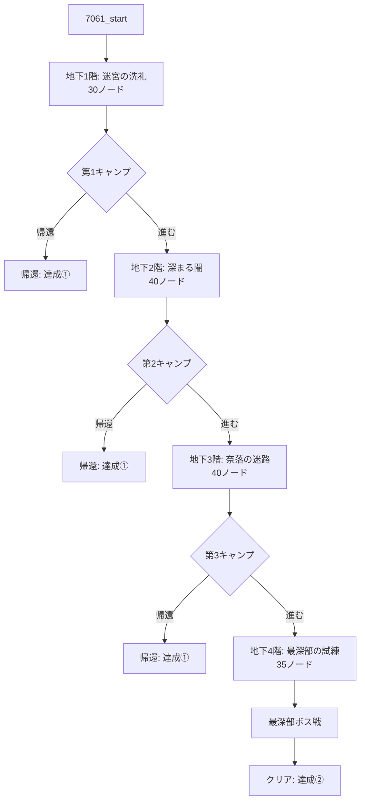

# 個別仕様書：「狭間の迷宮・上層 (7061)」

## 1. 基本情報

| 項目 | 設定値 |
| :--- | :--- |
| **クエストID** | `7061` |
| **スラグ** | `qst_rift_upper` |
| **タイトル** | 狭間の迷宮・上層 |
| **クエスト種別** | Special |
| **推奨レベル** | 8 |
| **難易度** | 3 |
| **制限時間 (time_cost)** | 成功時: 6日 / 失敗時: 4日 |
| **出現条件** | 「狭間の迷宮・プロローグ (7060)」をクリアしていること |
| **リピート受注** | 可能 |
| **クリア報酬（通常）** | 経験値: 1200 / ゴールド: 600G / 名声: +15 |
| **クリア報酬（特別）** | 重要クエストアイテム「**赤の宝珠**」 (itemId: 326 / 装備部位: 装飾品 / 効果: HP+3, DEF+1) |

---

## 2. アセット定義と生成計画

上層階の専用演出および情景描写のため、以下の新規アセットを導入・定義し、実行フェーズで生成します。

### 2.1. 新規探索BGM
*   **アセットキー**: `bgm_rift_upper`
*   **ファイル名**: `public/sounds/bgm/bgm_rift_upper.mp3`
*   **演出用途**: 上層階（B1F〜B4F）の通常探索用BGM。

### 2.2. 背景画像（使い分け）
*   **`bg_rift_upper_01`**: 迷宮の上層階通路、細長い石造りの廊下、崩れかけた部屋などで使用。
*   **`bg_rift_upper_02`**: より深奥の暗い広間、不気味な青い光が漏れ出る空間、大空洞などで使用。
*   **`bg_rift_entrance`**: クエスト開始時の迷宮入り口ノードのみで使用。
*   **`bg_rift_camp`**: 各階の境界にある安全なキャンプ地ノードで使用。
*   **`bg_rift_maze`**: 最深部（B4F）のボス部屋で使用。

### 2.3. 前景レイヤー画像 (Sprites)
*   **`fg_rift_chest`**: 宝箱発見時に背景の上に重ねて表示（透過背景版）。
*   **`fg_rift_merchant`**: 怪しい商人とのエンカウント時に重ねて表示（透過背景版）。
*   **`fg_rift_well`**: 古井戸ノードで使用。 (`public/images/quests/fg_rift_well.png`)
*   **`fg_rift_spring`**: 湧き水の泉ノードで使用。 (`public/images/quests/fg_rift_spring.png`)
*   **`fg_rift_trap_spears`**: 槍トラップ作動時のアニメーションレイヤー。 (`public/images/quests/fg_rift_trap_spears.png`)
*   **`fg_rift_door_basic`**: 通常の木製の扉の演出用レイヤー画像。 (`public/images/quests/fg_rift_door_basic.png`)
*   **`fg_rift_door_iron`**: 迷宮の鉄格子の扉の演出用レイヤー画像。 (`public/images/quests/fg_rift_door_iron.png`)
*   **`fg_rift_door_boss`**: ボス部屋前の「混沌の大扉」の演出用レイヤー画像。 (`public/images/quests/fg_rift_door_boss.png`)

---

## 3. 特殊ゲームシステム

### 3.1. キャンプシステム (計3回)
地下1階、地下2階、地下3階の最奥（階層の節目）にキャンプ地を設置します。
*   **行動選択**:
    1.  **装備変更・アイテム使用**: インベントリ画面を開き、探索で得た装備の変更やポーションでの回復が可能。
    2.  **探索を続ける**: 次の階層へ進む。
    3.  **街に帰還する (達成①)**:
        *   探索をその場で切り上げて安全に帰還。
        *   それまでに獲得した経験値やドロップアイテムはすべて持ち帰ることができますが、中層（7062）は解放されません。

### 3.2. 怪しい商人とのその場取引システム (ランダム可変・未鑑定演出)
地下2階で遭遇する怪しい商人から、画面遷移を行わずにその場で取引（購入）を行うための特殊処理です。

*   **取引処理の流れ**:
    1.  遭遇時、商人は販売する品物を明かさず、一律 **30,000ゴールド** の高額でオファーします。
    2.  **裏抽選**: クライアント側で事前に以下の10種プールから確率で販売品を決定します（手裏剣は激レア、人食い・外套はレア扱い）。
        *   `314`: 手裏剣 (激レア) ➔ **重み: 1**
        *   `311`: 妖刀「人食い」 (レア) ➔ **重み: 5**
        *   `318`: 暗黒の外套 (レア) ➔ **重み: 5**
        *   `312`: 破魔の戦斧 (ノーマル) ➔ **重み: 13**
        *   `313`: 霊木の杖 (ノーマル) ➔ **重み: 13**
        *   `316`: 深淵の盾 (ノーマル) ➔ **重み: 13**
        *   `317`: 聖霊のローブ (ノーマル) ➔ **重み: 13**
        *   `321`: 深緑のアミュレット (ノーマル) ➔ **重み: 13**
        *   `324`: 守護のタリスマン (ノーマル) ➔ **重み: 12**
        *   `325`: 怒りの腕輪 (ノーマル) ➔ **重み: 12**
    3.  **「購入する」を選んだ場合**:
        *   `lootPool` に `{ itemId: "gold", quantity: -30000 }` と、抽選された上記アイテムをプッシュ。
    4.  **「断る」を選んだ場合**:
        *   商人が去り際に「ククク、こんないいもの（[merchant_item_name]）を逃すとは、もったいないことを……」と呟いて消え、品物の正体が明かされます。

---

### 3.3. 宝箱のランダム抽選システム（鑑定システム連携）
各ランダムバトル勝利後やダンジョン内の宝箱ノードにおいて、あらかじめプールされたアイテム群から確率に基づいて動的にドロップが決定される「ランダム抽選ロジック」を採用します。
全体の約 **15%** の確率で「鑑定済みの価値の低い通常アイテム（20種）」が出現し、残りの約 **85%** で「未鑑定アイテム（706〜709）」が出現するように重みを設計します。

*   **宝箱抽選確率テーブル (上層専用、合計重み1000)**:
    | 分類 | 排出対象 | ID | 重み（確率） |
    | :--- | :--- | :---: | :---: |
    | **未鑑定 (85%)** | 未鑑定アイテム (N) | 706 | 425 (42.5%) |
    | | 未鑑定アイテム (R) | 707 | 298 (29.8%) |
    | | 未鑑定アイテム (SR) | 708 | 110 (11.0%) |
    | | 未鑑定アイテム (UR) | 709 | 17 (1.7%) |
    | **通常品 (15%)** | 傷薬 / 砂防の革甲 / 良質な鉄鉱石 など計20種 | 15〜 | 各7〜8 (計15.0%) |

---

## 4. 各フロアのノード構成とテーマ

全体で **約145〜150ノード** を構築します。



### 4.1. 地下1階：迷宮の洗礼（30ノード）
*   **使用ビジュアル**: 背景: `bg_rift_entrance` -> `bg_rift_upper_01` / 前景: `fg_rift_door_iron`, `fg_rift_door_basic`, `fg_rift_chest`
*   **宝箱構成**: バトル勝利後および隠し宝箱において、上記確率プール（未鑑定85%:通常15%）によるランダム抽選が発生。

### 4.2. 地下2階：深まる闇と他者の影（40ノード）
*   **使用ビジュアル**: 背景: `bg_rift_upper_01` -> `bg_rift_upper_02` / 前景: `fg_rift_merchant`, `fg_rift_well`, `fg_rift_chest`

### 4.3. 地下3階：奈落の迷路（40ノード）
*   **使用ビジュアル**: 背景: `bg_rift_upper_02` / 前景: `fg_rift_spring`, `fg_rift_trap_spears`, `fg_rift_chest`

### 4.4. 地下4階：最深部への試練（35ノード）
*   **使用ビジュアル**: 背景: `bg_rift_upper_02` -> `bg_rift_maze` / 前景: `fg_rift_door_boss`, `fg_rift_trap_spears`
*   **クリアノード（帰還演出）**: ボス撃破後、確定で「赤の宝珠 (326)」を獲得。それと並行して「地上に向かう長い階段」を見つけて這い上がり自動帰還。

---

## 5. 主要ノードのテキスト・パラメータ設計例

### ① バトル勝利後の宝箱ノード例 (ランダム抽選適用)
*   **Node ID**: `7061_b1f_battle_win`
*   **背景 / 前景**: `bg_rift_upper_01` / `fg_rift_chest`
*   **パラメータ**:
    ```json
    {
      "bg": "bg_rift_upper_01",
      "type": "reward",
      "gold": 80,
      "item_pool": [
        {"item_id": 706, "weight": 425},
        {"item_id": 707, "weight": 298},
        {"item_id": 708, "weight": 110},
        {"item_id": 709, "weight": 17},
        {"item_id": 15, "weight": 8},
        {"item_id": 16, "weight": 7},
        {"item_id": 17, "weight": 7},
        {"item_id": 18, "weight": 7},
        {"item_id": 19, "weight": 7},
        {"item_id": 20, "weight": 7},
        {"item_id": 21, "weight": 7},
        {"item_id": 53, "weight": 7},
        {"item_id": 558, "weight": 7},
        {"item_id": 559, "weight": 7},
        {"item_id": 561, "weight": 7},
        {"item_id": 563, "weight": 7},
        {"item_id": 564, "weight": 7},
        {"item_id": 568, "weight": 8},
        {"item_id": 572, "weight": 8},
        {"item_id": 214, "weight": 8},
        {"item_id": 245, "weight": 8},
        {"item_id": 430, "weight": 8},
        {"item_id": 431, "weight": 7},
        {"item_id": 700, "weight": 7}
      ]
    }
    ```
*   **テキスト**:
    > 打ち倒した魔物の奥から、古い鉄帯で補強された黒い宝箱を見つけた。中に眠る未鑑定の遺物や日用品は、私達に何をもたらすのだろうか……。

### ② 怪しい商人ノード (地下2階)
*   **Node ID**: `7061_b2f_merchant`
*   **背景 / 前景**: `bg_rift_upper_01` / `fg_rift_merchant`
*   **パラメータ**:
    ```json
    {
      "bg": "bg_rift_upper_01",
      "type": "merchant_trade",
      "price": 30000,
      "merchant_pool": [
        {"item_id": 314, "weight": 1},
        {"item_id": 311, "weight": 5},
        {"item_id": 318, "weight": 5},
        {"item_id": 312, "weight": 13},
        {"item_id": 313, "weight": 13},
        {"item_id": 316, "weight": 13},
        {"item_id": 317, "weight": 13},
        {"item_id": 321, "weight": 13},
        {"item_id": 324, "weight": 12},
        {"item_id": 325, "weight": 12}
      ]
    }
    ```
*   **テキスト**:
    > 暗がりに黒いフードを深く被った人影が立っている。男は怪しげに笑い、こちらに正体の分からぬ品を差し出してきた。「……迷宮の奥へ進むなら、この品を持っていかんかね？ 30,000ゴールドで譲ってやろう……中身は手にしてからのお楽しみだ」
*   **選択肢**:
    1.  `30,000Gを支払い、その品を購入する` ➔ 遷移先: `7061_b2f_merchant_buy`
    2.  `断る` ➔ 遷移先: `7061_b2f_merchant_refuse`

### ③ 商人取引・断るリアクションノード
*   **Node ID**: `7061_b2f_merchant_refuse`
*   **背景**: `bg_rift_upper_01`
*   **テキスト**:
    > フードの男は不気味にくつくつと笑った。「ククク……まさかこの『[merchant_item_name]』を逃すとはな。後悔しても遅いぞ……」男はそう言い残すと、闇の中に掻き消えるように去っていった。
