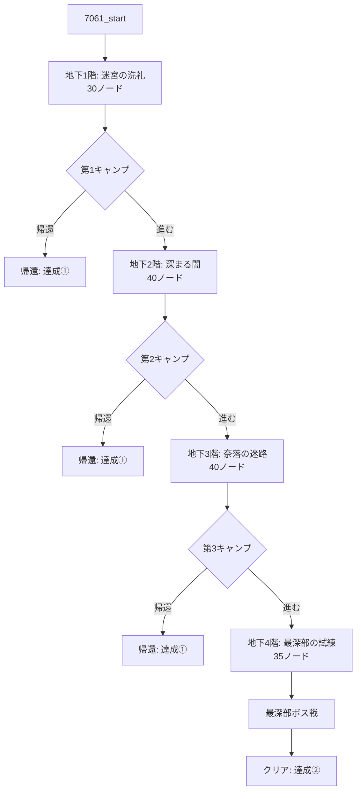

# 個別仕様書：「狭間の迷宮・上層 (7061)」

## 1. 基本情報

| 項目 | 設定値 |
| :--- | :--- |
| **クエストID** | `7061` |
| **スラグ** | `qst_rift_upper` |
| **タイトル** | 狭間の迷宮・上層 |
| **クエスト種別** | Special |
| **推奨レベル** | 8 |
| **難易度** | 3 |
| **制限時間 (time_cost)** | 成功時: 6日 / 失敗時: 4日 |
| **出現条件** | 「狭間の迷宮・プロローグ (7060)」をクリアしていること |
| **リピート受注** | 可能 |
| **クリア報酬（通常）** | 経験値: 1200 / ゴールド: 600G / 名声: +15 |
| **クリア報酬（特別）** | 重要クエストアイテム「**赤の宝珠**」 (itemId: 326 / 装備部位: 装飾品 / 効果: HP+3, DEF+1) |

---

## 2. アセット定義と生成計画

上層階の専用演出および情景描写のため、以下の新規アセットを導入・定義し、実行フェーズで生成します。

### 2.1. 新規探索BGM
*   **アセットキー**: `bgm_rift_upper`
*   **ファイル名**: `public/sounds/bgm/bgm_rift_upper.mp3`
*   **演出用途**: 上層階（B1F〜B4F）の通常探索用BGM。

### 2.2. 背景画像（使い分け）
*   **`bg_rift_upper_01`**: 迷宮の上層階通路、細長い石造りの廊下、崩れかけた部屋などで使用。
*   **`bg_rift_upper_02`**: より深奥の暗い広間、不気味な青い光が漏れ出る空間、大空洞などで使用。
*   **`bg_rift_entrance`**: クエスト開始時の迷宮入り口ノードのみで使用。
*   **`bg_rift_camp`**: 各階の境界にある安全なキャンプ地ノードで使用。
*   **`bg_rift_maze`**: 最深部（B4F）のボス部屋で使用。

### 2.3. 前景レイヤー画像 (Sprites)
*   **`fg_rift_chest`**: 宝箱発見時に背景の上に重ねて表示（透過背景版）。
*   **`fg_rift_merchant`**: 怪しい商人とのエンカウント時に重ねて表示（透過背景版）。
*   **`fg_rift_well`**: 古井戸ノードで使用。 (`public/images/quests/fg_rift_well.png`)
*   **`fg_rift_spring`**: 湧き水の泉ノードで使用。 (`public/images/quests/fg_rift_spring.png`)
*   **`fg_rift_trap_spears`**: 槍トラップ作動時のアニメーションレイヤー。 (`public/images/quests/fg_rift_trap_spears.png`)
*   **`fg_rift_door_basic`**: 通常の木製の扉の演出用レイヤー画像。 (`public/images/quests/fg_rift_door_basic.png`)
*   **`fg_rift_door_iron`**: 迷宮の鉄格子の扉の演出用レイヤー画像。 (`public/images/quests/fg_rift_door_iron.png`)
*   **`fg_rift_door_boss`**: ボス部屋前の「混沌の大扉」の演出用レイヤー画像。 (`public/images/quests/fg_rift_door_boss.png`)

---

## 3. 特殊ゲームシステム

### 3.1. キャンプシステム (計3回)
地下1階、地下2階、地下3階の最奥（階層 of 節目）にキャンプ地を設置します。
*   **行動選択**:
    1.  **装備変更・アイテム使用**: インベントリ画面を開き、探索で得た装備の変更やポーションでの回復が可能。
    2.  **探索を続ける**: 次の階層へ進む。
    3.  **街に帰還する (達成①)**:
        *   探索をその場で切り上げて安全に帰還。
        *   それまでに獲得した経験値やドロップアイテムはすべて持ち帰ることができますが、中層（7062）は解放されません。

### 3.2. 怪しい商人とのその場取引システム
地下2階で遭遇する怪しい商人から、画面遷移を行わずにその場で取引（購入）を行うためのロジックです。
*   **取引処理の流れ**:
    1.  プレイヤーの所持ゴールドをチェック。
    2.  購入選択時、フロントエンドの `questState.lootPool` に以下の両方をプッシュ。
        *   `{ itemId: "gold", quantity: -250 }` （ゴールドのマイナス値）
        *   `{ itemId: 311, quantity: 1 }` （購入するアイテム：妖刀「人食い」）
    3.  クエストクリア（または途中帰還）時、サーバーAPIが自動的に所持ゴールドから250Gを減算し、インベントリにアイテムを追加します。

### 3.3. 宝箱のランダム抽選システム（未鑑定アイテム連携）
各ランダムバトル勝利後やダンジョン内の宝箱ノードにおいて、固定の報酬ではなく、あらかじめプールされたアイテム群から確率に基づいて動的にドロップが決定される「ランダム抽選ロジック」を採用します。

*   **未鑑定アイテムマスタ**:
    道具屋の改修ですでに実装が完了している **`4001: 未鑑定の魔導宝箱`**（`item_demon_chest_unidentified`）を確率ドロップの対象とします。これを街に持ち帰って道具屋の鑑定機能を利用することで、N〜UR のアイテムに変化するフローと連携します。

*   **宝箱抽選確率テーブル (上層専用)**:
    | 排出対象 | ID | ドロップ確率（重み） |
    | :--- | :--- | :---: |
    | **未鑑定の魔導宝箱** | 4001 | 35% |
    | **良質な鉄鉱石** | 430 | 40% |
    | **傷薬** | 15 | 25% |

*   **パラメータ設定例 (JSON)**:
    ```json
    "type": "reward",
    "item_pool": [
      {"item_id": 4001, "weight": 35},
      {"item_id": 430, "weight": 40},
      {"item_id": 15, "weight": 25}
    ]
    ```

---

## 4. 各フロアのノード構成とテーマ

全体で **約145〜150ノード** を構築します。



### 4.1. 地下1階：迷宮の洗礼（30ノード）
*   **使用ビジュアル**: 背景: `bg_rift_entrance` -> `bg_rift_upper_01` / 前景: `fg_rift_door_iron`, `fg_rift_door_basic`, `fg_rift_chest`
*   **宝箱構成**: バトル勝利後および隠し宝箱において、上記確率プール（4001, 430, 15）によるランダム抽選が発生。

### 4.2. 地下2階：深まる闇と他者の影（40ノード）
*   **使用ビジュアル**: 背景: `bg_rift_upper_01` -> `bg_rift_upper_02` / 前景: `fg_rift_merchant`, `fg_rift_well`, `fg_rift_chest`

### 4.3. 地下3階：奈落の迷路（40ノード）
*   **使用ビジュアル**: 背景: `bg_rift_upper_02` / 前景: `fg_rift_spring`, `fg_rift_trap_spears`, `fg_rift_chest`

### 4.4. 地下4階：最深部への試練（35ノード）
*   **使用ビジュアル**: 背景: `bg_rift_upper_02` -> `bg_rift_maze` / 前景: `fg_rift_door_boss`, `fg_rift_trap_spears`
*   **クリアノード（帰還演出）**: ボス撃破後、確定で「赤の宝珠 (326)」を獲得。それと並行して「地上に向かう長い階段」を見つけて這い上がり自動帰還。

---

## 5. 主要ノードのテキスト・パラメータ設計例

### ① バトル勝利後の宝箱ノード例 (ランダム抽選適用)
*   **Node ID**: `7061_b1f_battle_win`
*   **背景 / 前景**: `bg_rift_upper_01` / `fg_rift_chest`
*   **パラメータ**:
    ```json
    {
      "bg": "bg_rift_upper_01",
      "type": "reward",
      "gold": 80,
      "item_pool": [
        {"item_id": 4001, "weight": 35},
        {"item_id": 430, "weight": 40},
        {"item_id": 15, "weight": 25}
      ]
    }
    ```
*   **テキスト**:
    > 打ち倒した魔物の奥から、古い鉄帯で補強された黒い宝箱を見つけた。中に眠る未鑑定の遺物は、私達に何をもたらすのだろうか……。

### ② 古井戸ノード (地下2階)
*   **Node ID**: `7061_b2f_well`
*   **背景 / 前景**: `bg_rift_upper_01` / `fg_rift_well`
*   **テキスト**:
    > 通路の隅に、ひっそりと古びた石井戸が佇んでいる。底からはひんやりとした風が吹き抜けており、暗闇の奥で何かがかすかに光っているように見える……。
*   **選択肢**:
    1.  `井戸をのぞき込んでみる` ➔ 遷移先: `7061_b2f_well_check`
    2.  `関わらずに先を急ぐ` ➔ 遷移先: `7061_b2f_next`

### ③ 怪しい商人ノード (地下2階)
*   **Node ID**: `7061_b2f_merchant`
*   **背景 / 前景**: `bg_rift_upper_01` / `fg_rift_merchant`
*   **テキスト**:
    > 暗がりに黒いフードを深く被った人影が立っている。こちらの気配に気づくと、男は懐から禍々しい光を放つ一本の刀を取り出し、不気味に囁きかけてきた。「……迷宮の奥へ進むなら、この妖刀『人食い』を持っていかんかね？ 250ゴールドで譲ってやろう……」
