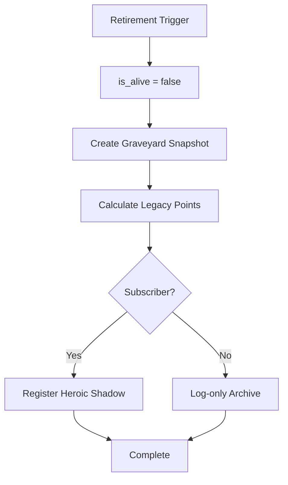

Code: Wirth-Dawn Specification v11.0 (Revised based on actual implementation)
# Retirement & Heroic Spirit System

## 1. 概要 (Overview)
キャラクターの引退、英霊（Heroic Spirit）システム、および次世代への資産継承を定義する。

<!-- v11.0: LifeCycleServiceの実装と/api/character/retireを反映 -->

---

## 2. 引退トリガー (Retirement Triggers)

### 2.1 自動引退 (Vitality Depletion)
- **条件**: `vitality <= 0`
- **原因文字列**: `'Vitality Depletion'`

### 2.2 自主引退 (Voluntary)
- **API**: `POST /api/character/retire`
- **Body**: `{ cause: 'voluntary', heirloom_item_id?: string }`
- **原因文字列**: `'Voluntary Retirement'`

---

## 3. 引退処理フロー (LifeCycleService.handleCharacterDeath)
<!-- v11.0: lifeCycleService.ts の実装を反映 -->

### 3.1 墓地スナップショット (Graveyard Data)
引退/死亡時に以下のデータを保存:
- キャラクター名、レベル、年齢
- 死因 (cause)
- 最終拠点
- 統計情報（クエスト数、バトル数等）

### 3.2 英霊登録 (Heroic Shadow Registration)
- `party_members` テーブルに `origin: 'ghost'`, `origin_type: 'shadow_heroic'` として挿入。
- ステータスは**固定** (frozen): 引退時のステータスが永続。
- AI Grade: `smart`。
- **デッキ**: 引退時の装備カード（消耗品を除く）が `inject_cards` として保存。

---

## 4. 継承システム (Succession)
<!-- v11.0: LifeCycleService.processInheritance() を反映 -->

### 4.1 API: POST /api/character/create (新キャラ作成時)
新キャラクター作成時に `processInheritance()` が呼ばれ、前世代の遺産を引き継ぐ。

### 4.2 継承テーブル

| 資産 | 継承率 | 条件 |
|---|---|---|
| ゴールド | 50% | 全ユーザー |
| 名声 (各拠点) | 30% | 全ユーザー |
| 形見アイテム | 1個 | 引退時に選択（`heirloom_item_id`） |
| デッキ / レシピ | 0% | **継承なし** |
| レベル / EXP | 0% | **Lv1からリスタート** |

### 4.3 形見アイテム (Heirloom)
- 引退API呼び出し時に `heirloom_item_id` を指定。
- 新キャラ作成時に `inventory` テーブルに挿入。
- 1個限定。

---

## 5. スロット管理
<!-- v11.0: 実装の現状を反映 -->

### 5.1 キャラクタースロット
| Tier | スロット数 | 条件 |
|---|---|---|
| Free | 1 | デフォルト |
| Subscriber | 3 | サブスクリプション加入 |

### 5.2 プロフィール選択
- `selectedProfileId` で現在のアクティブプロフィールを管理。
- `setSelectedProfileId(id)` で切り替え。

---

## 6. 実装上の注意点

### 6.1 認証
<!-- v11.0: /api/character/retire の認証パターンを反映 -->
- retire API は `supabase.from('user_profiles').select('*').limit(1)` で最初のプロフィールを取得（簡略化実装）。
- `is_alive` チェック: 既に死亡/引退済みの場合は 400 エラー。
- Service Role Client の使用: 環境変数有無で自動判定。

### 6.2 未実装の要素
| 機能 | 状態 |
|---|---|
| 英霊のデッキバリデーション（禁術/消耗品除外） | 簡略化実装 |
| サブスク判定による英霊登録分岐 | 未実装（全員登録される） |
| 形見アイテムの実際の在庫挿入 | レスポンスに含むのみ |
