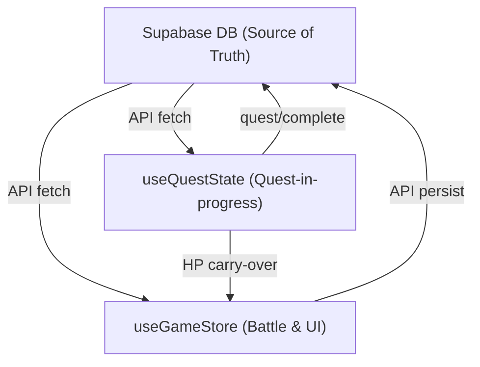

Code: Wirth-Dawn Specification v11.0 (New Document)
# Actual Implementation Logic — 実装由来ルールと例外規定

## 1. 概要 (Overview)
本ドキュメントは、バグ修正やリファクタリングの過程で導入された「仕様書に未記載だった実装ルール」を正式に文書化する。
既存仕様書（v1〜v10）では扱わないクロスカッティングな懸念事項や、実装固有の設計判断をまとめる。

<!-- v11.0: 新規作成 -->

---

## 2. 認証と API 設計パターン
<!-- v11.0: bug fix #equip-toggle, #sell-auth に由来 -->

### 2.1 認証パターン一覧

| パターン | 使用箇所 | 仕組み |
|---|---|---|
| JWT Bearer | Shop Sell, Inventory GET | `Authorization` ヘッダーからトークンを取得 → `supabase.auth.getUser()` |
| x-user-id Header | Inventory PATCH (Equip) | `x-user-id` ヘッダーでユーザーIDを直接指定 |
| Service Role Bypass | Shop Sell, Quest Complete, Retire | `SUPABASE_SERVICE_ROLE_KEY` で RLS をバイパス |
| First Profile | Retire, Travel Cost | `.limit(1)` or `DEMO_USER_ID` フォールバック |

### 2.2 RLS バイパスの理由
- `inventory` テーブルは認証ユーザーのみ読み書き可能なRLSポリシーを持つ。
- サーバーサイドAPI（Next.js Route Handler）はクライアントとは別のセッションで動作するため、Service Role Key を使ってRLSを回避する必要がある。

---

## 3. 状態管理アーキテクチャ

### 3.1 3層ステート構造

| Store | Persist | 管理対象 |
|---|---|---|
| `useGameStore` | localStorage (`game-storage`) | バトル状態、インベントリキャッシュ、ワールド状態 |
| `useQuestState` | localStorage (`quest-storage`) | クエスト進行中の一時状態（HP、ルート、消費品） |
| Supabase DB | PostgreSQL | 永続データ（プロフィール、在庫、パーティ、世界状態） |

### 3.2 データフロー：バトル開始〜クエスト完了
1. **バトル開始**: `gameStore.startBattle()` → パーティ取得 (API) → デッキ構築 (client)
2. **バトル中**: `attackEnemy()`, `processPartyTurn()`, `processEnemyTurn()` — 全てクライアント
3. **バトル後**: `useQuestState.updateAfterBattle()` — HP/NPC死亡/ルート記録
4. **クエスト完了**: `POST /api/quest/complete` — EXP/Gold/Aging をDBに反映

---

## 4. 実装由来の例外規定

### 4.1 同一アイテムの複数行問題
<!-- v11.0: bug fix #sell-404 に由来 -->
- **原因**: ショップ購入APIは、アイテム購入のたびに `inventory` テーブルに新規行を INSERT する。
- **結果**: 同一 `item_id` の行が複数存在する。
- **対処**: Sell API で `.limit(1)` を使用し、最初の一致行のみを処理。
- **正規化判定**: ✅ **正規仕様** — UUID PK による個別管理は将来の拡張（耐久度、強化値など）に対応可能。

### 4.2 装備中アイテムの売却禁止
<!-- v11.0: bug fix #equip-sell に由来 -->
- **ルール**: `is_equipped === true` のアイテムは売却不可（400エラー）。
- **理由**: 装備解除なしの売却はデッキ整合性を破壊する。
- **正規化判定**: ✅ **正規仕様**。

### 4.3 バトルの30ターン制限
<!-- v11.0: gameStore.endTurn() に由来 -->
- **ルール**: 30ターン到達で `battle_result: 'time_over'` → 敗北。
- **理由**: 無限ループ防止。
- **正規化判定**: ✅ **正規仕様**。

### 4.4 drain_vit の1ターン1回制限
<!-- v11.0: gameStore.processEnemyTurn() L1026 に由来 -->
- **ルール**: multi-enemy バトルでも、`vitDamageTakenThisTurn` フラグにより1ターンで Vitality は最大1しか減らない。
- **理由**: 複数の drain_vit 持ちの敵に囲まれた場合の即死防止。
- **正規化判定**: ✅ **正規仕様**。

---

## 5. 技術債務一覧

### 5.A 正規仕様化（このまま維持）

| 項目 | 根拠 |
|---|---|
| クライアントサイドバトルエンジン | レスポンス高速化 |
| `inventory` テーブル (UUID PK) | 拡張性 |
| `neighbors: Record<string, number>` | 十分な表現力 |
| `BASE_HP = 80` | プレイ調整済み |
| `EXP = 50 * Lv²` | プレイ調整済み |
| `base_price / 2` 固定売却 | インフレ未稼働 |
| `x-user-id` 認証パターン | RLSバイパスの実用解 |

### 5.B 暫定実装（将来改修予定）

| 項目 | 本来の仕様 | 優先度 |
|---|---|---|
| 裏切りシステム未実装 | key_item売却→クエスト失敗 | 高 |
| Hand Size段階的上昇 未実装 | Lv10: 4枚→Lv20: 5枚 | 中 |
| ノイズ混入防止（初心者）未実装 | Lv<=5でノイズ無効 | 低（繁栄度未稼働） |
| ロイヤリティ経済 未実装 | 残影雇用報酬 | 低（サブスク未実装） |
| Dijkstra経路探索 未実装 | 最短経路計算 | 低（隣接のみで機能中） |
| 共鳴ボーナス 未実装 | 同一拠点ATK/DEF+10% | 低 |
| `check_delivery`/`check_possession` 未実装 | シナリオアイテム判定 | 中 |
| Smart AI の戦略判定未実装 | 効率的スキル選択 | 低 |

---

## 6. UI/UX 連動仕様

### 6.1 演出トリガー

| トリガー | 演出 | 実装箇所 |
|---|---|---|
| レベルアップ | ファンファーレ + ステータス上昇表示 | Quest Result画面 |
| 老化 | 「寿命の翳り」メッセージ | Quest Result画面 |
| Vitality ダメージ | 「生命力を奪われた！」ログ | バトルメッセージ |
| NPC死亡 | 「〇〇は力尽きた...」ログ | バトルメッセージ |
| 30ターン到達 | 「時間切れ...撤退を余儀なくされた。」 | バトルメッセージ |
| ノイズ廃棄 | 「〇〇を廃棄した！ (AP -X)」ログ | バトルメッセージ |

### 6.2 APIレスポンスの演出用フィールド
- `battle_result`: `'victory'` / `'time_over'` / undefined
- `levelInfo.level_up`: boolean — レベルアップ演出のトリガー
- `decay.vit > 0`: 老化演出のトリガー
