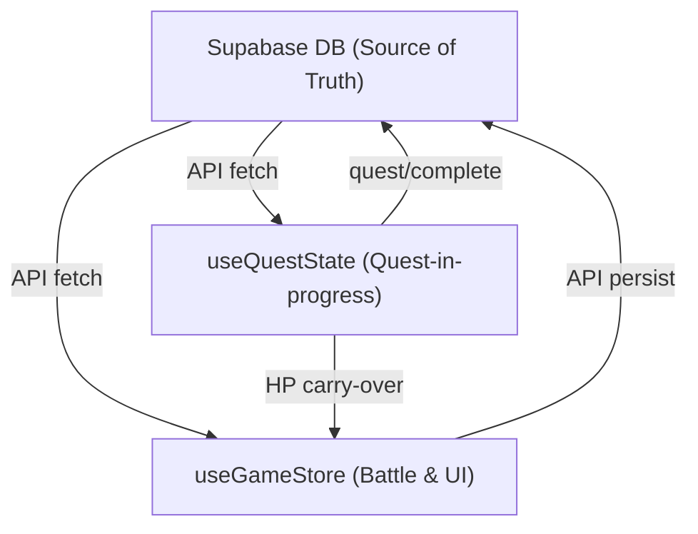

Code: Wirth-Dawn Specification v11.0 (New Document)
# Actual Implementation Logic — 実装由来ルールと例外規定

## 1. 概要 (Overview)
本ドキュメントは、バグ修正やリファクタリングの過程で導入された「仕様書に未記載だった実装ルール」を正式に文書化する。
既存仕様書（v1〜v10）では扱わないクロスカッティングな懸念事項や、実装固有の設計判断をまとめる。

<!-- v11.0: 新規作成 -->

---

## 2. 認証と API 設計パターン
<!-- v11.0: bug fix #equip-toggle, #sell-auth に由来 / v11.1: 匿名認証+OAuthの導入 -->

### 2.1 認証基盤 (spec v14 実装済み)
シームレスなユーザー体験を実現するため、以下のモダンな認証フローを基本とする。

1. **匿名ログイン (Anonymous Sign-in) をデフォルト化** ✅ 実装済み
   - タイトル画面の「はじめる」押下時、未ログイン状態であれば `supabase.auth.signInAnonymously()` を呼び出し、バックグラウンドでユーザー（UUID）を作成する。
   - `DEMO_USER_ID` という固定のゲストID概念は**廃止**し、すべてのユーザーがDB上に固有の `user_profiles` レコードを持つようにする。
2. **ソーシャルログイン (OAuth) による連携・永続化** ✅ 実装済み
   - 既存のメールアドレス＆パスワードによるユーザー登録・ログイン画面は**廃止**する。
   - 代わりに、設定画面（`AccountSettingsModal.tsx`）から Google などの OAuth プロバイダを用いて、現在の匿名アカウントに「アカウント連携（`supabase.auth.linkIdentity()`）」を行うことで、データ引き継ぎとアカウントの永続化を実現する。

### 2.2 APIアクセス制御パターン
| パターン | 使用箇所 | 仕組み |
|---|---|---|
| JWT Bearer Context | 全般 (Shop, Quest, Battle, Retire 等) | `src/lib/supabase-auth.ts` の `createAuthClient(req)` を用い、リクエストヘッダの認証トークンを利用して安全にクライアントを生成し、DB側で RLS によるアクセス制御を強制する。これまでの `SUPABASE_SERVICE_ROLE_KEY` による無差別な管理者権限バイパスは標準APIからは撤廃された（セキュリティ監査対応済）。 |

---

## 3. 状態管理アーキテクチャ

### 3.1 3層ステート構造

```mermaid
graph TD
    DB["Supabase DB (Source of Truth)"]
    QS["useQuestState (Quest-in-progress)"]
    GS["useGameStore (Battle & UI)"]

    DB -->|"API fetch"| GS
    DB -->|"API fetch"| QS
    GS -->|"API persist"| DB
    QS -->|"quest/complete"| DB
    QS -->|"HP carry-over"| GS
```

| Store | Persist | 管理対象 |
|---|---|---|
| `useGameStore` | localStorage (`game-storage`) | バトル状態、インベントリキャッシュ、ワールド状態 |
| `useQuestState` | localStorage (`quest-storage`) | クエスト進行中の一時状態（HP、ルート、消費品） |
| Supabase DB | PostgreSQL | 永続データ（プロフィール、在庫、パーティ、世界状態） |

### 3.2 データフロー：バトル開始〜クエスト完了
1. **バトル開始 (Server Init)**: `POST /api/battle/start` にてサーバー側に `battle_sessions` レコードを作成し、ステータスを永続化・検証のベースとする。
2. **バトル中 (Server-Authoritative)**: UIのレスポンスを担保するためクライアント側（`gameStore`）で Optimistic UI として先行して描画を行うが、裏で非同期に `POST /api/battle/action` をコールし、サーバー側でAP消費やダメージ（チート・改ざんの有無）を検証・保存する。
3. **バトル後**: `useQuestState.updateAfterBattle()` — HP/NPC死亡/ルート記録
4. **クエスト完了**: `POST /api/quest/complete` — EXP/Gold/Aging をDBに反映

### 3.3 クエスト条件判定におけるデータ型マッチング (v11.1追加)
シナリオエンジン（`check_delivery`, `check_possession`）等のインベントリ検索ロジックにおいては、JSON等からのデシリアライズ経由で `item_id` の型が Integer や String に揺れるケースがあるため、**厳密一致ではなく `String(item_id) === String(required_id)` と文字列キャストしてマッチング**する設計とする。また、バックエンドAPI (`/api/shop/*`, `/api/inventory/consume`) 側でも `Number()` の強制キャストは行わず、Supabaseのネイティブな型解決に任せることで安全性を確保する。

---

## 4. 実装由来の例外規定

### 4.1 同一アイテムの複数行問題
<!-- v11.0: bug fix #sell-404 に由来 -->
- **原因**: ショップ購入APIは、アイテム購入のたびに `inventory` テーブルに新規行を INSERT する。
- **結果**: 同一 `item_id` の行が複数存在する。
- **対処**: Sell API で `.limit(1)` を使用し、最初の一致行のみを処理。
- **正規化判定**: ✅ **正規仕様** — UUID PK による個別管理は将来の拡張（耐久度、強化値など）に対応可能。

### 4.2 装備中アイテムの売却禁止
<!-- v11.0: bug fix #equip-sell に由来 -->
- **ルール**: `is_equipped === true` のアイテムは売却不可（400エラー）。
- **理由**: 装備解除なしの売却はデッキ整合性を破壊する。
- **正規化判定**: ✅ **正規仕様**。

### 4.3 バトルの30ターン制限
<!-- v11.0: gameStore.endTurn() に由来 -->
- **ルール**: 30ターン到達で `battle_result: 'time_over'` → 敗北。
- **理由**: 無限ループ防止。
- **正規化判定**: ✅ **正規仕様**。

### 4.4 drain_vit の1ターン1回制限
<!-- v11.0: gameStore.processEnemyTurn() L1026 に由来 -->
- **ルール**: multi-enemy バトルでも、`vitDamageTakenThisTurn` フラグにより1ターンで Vitality は最大1しか減らない。
- **理由**: 複数の drain_vit 持ちの敵に囲まれた場合の即死防止。
- **正規化判定**: ✅ **正規仕様**。

---

## 5. 技術債務一覧

### 5.A 正規仕様化（このまま維持）

| 項目 | 根拠 |
|---|---|
| Optimistic UI バトルエンジン | UXレスポンスの高速化と、サーバーサイド検証（Server-Authoritative）によるチート防止の両立（実装済み） |
| `inventory` テーブル (UUID PK) | 拡張性 |
| `neighbors: Record<string, { days: number; gold_cost: number }>` | 固定移動費用を含む形式（v12.0更新） |
| `BASE_HP = 80` | プレイ調整済み |
| `EXP = 50 * Lv²` | プレイ調整済み |
| `base_price / 2` 固定売却 | インフレ未稼働 |
| `check_delivery` / `check_possession` ノード | 実装済み (ScenarioEngine.tsx, String()キャスト対応) |
| 隣接移動のみ（Dijkstra 不採用） | 旅情UX方針 — プレイヤーに1拠点ずつ巡る体験を提供するため、最短経路探索は仕様から正式除外 |
| 裏切りシステム | key_item売却時のクエスト強制失敗と名声低下（実装済み） |
| Hand Size段階的上昇 | レベルに応じた手札枚数の拡張（Lv10で5枚など実装済み） |
| ロイヤリティ経済 | 英霊雇用時の報酬分配および日額上限（実装済み） |
| 共鳴ボーナス | 同一拠点におけるATK/DEF+10%（実装済み） |
| Smart AI の戦略判定 | 英霊のAP温存および緊急回復ロジック（実装済み / npcAI.ts） |
| ノイズ混入防止（初心者） | Lv5以下でのノイズカード免除処理（実装済み / battleEngine.ts） |

### 5.B 暫定実装（将来改修予定）

| 項目 | 本来の仕様 | 優先度 |
|---|---|---|
| 該当なし | 全ての基本機能が実装済み | - |

---

## 6. UI/UX 連動仕様

### 6.1 演出トリガー

| トリガー | 演出 | 実装箇所 |
|---|---|---|
| レベルアップ | ファンファーレ + ステータス上昇表示 | Quest Result画面 |
| 老化 | 「寿命の翳り」メッセージ | Quest Result画面 |
| Vitality ダメージ | 「生命力を奪われた！」ログ | バトルメッセージ |
| NPC死亡 | 「〇〇は力尽きた...」ログ | バトルメッセージ |
| 30ターン到達 | 「時間切れ...撤退を余儀なくされた。」 | バトルメッセージ |
| ノイズ廃棄 | 「〇〇を廃棄した！ (AP -X)」ログ | バトルメッセージ |

### 6.2 APIレスポンスの演出用フィールド
- `battle_result`: `'victory'` / `'time_over'` / undefined
- `levelInfo.level_up`: boolean — レベルアップ演出のトリガー
- `decay.vit > 0`: 老化演出のトリガー
