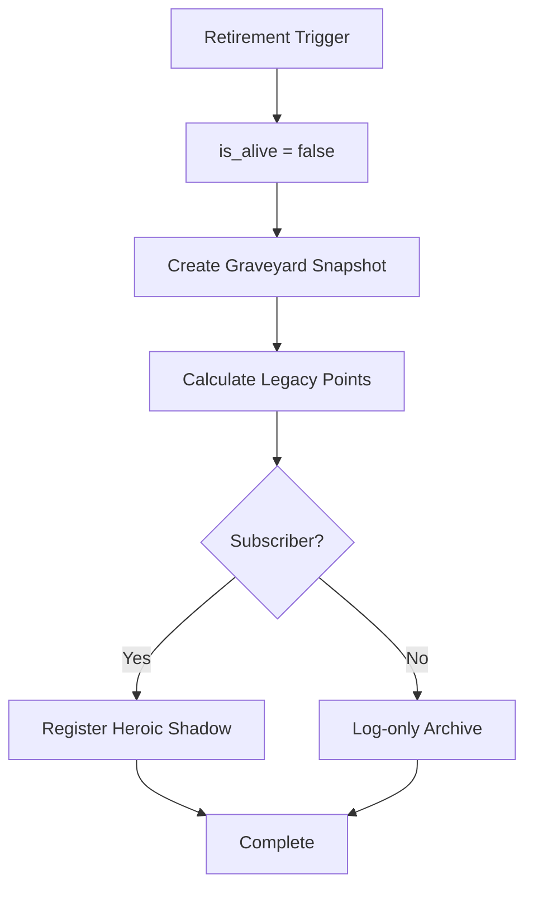

Code: Wirth-Dawn Specification v11.0 (Revised based on actual implementation)
# Retirement & Heroic Spirit System

## 1. 概要 (Overview)
キャラクターの引退、英霊（Heroic Spirit）システム、および次世代への資産継承を定義する。

<!-- v11.0: LifeCycleServiceの実装と/api/character/retireを反映 -->

---

## 2. 引退トリガー (Retirement Triggers)

### 2.1 自動引退 (Vitality Depletion)
- **条件**: `vitality <= 0`
- **原因文字列**: `'Vitality Depletion'`

### 2.2 自主引退 (Voluntary)
- **API**: `POST /api/character/retire`
- **Body**: `{ cause: 'voluntary', heirloom_item_ids?: string[], paid_gold_for_slots?: number }`
- **原因文字列**: `'Voluntary Retirement'`

---

## 3. 引退処理フロー (LifeCycleService.handleCharacterDeath)
<!-- v11.0: lifeCycleService.ts の実装を反映 -->

### 3.1 墓地スナップショット (Graveyard Data)
引退/死亡時に以下のデータを保存:
- キャラクター名、レベル、年齢
- 死因 (cause)
- 最終拠点
- 統計情報（クエスト数、バトル数等）

### 3.2 英霊登録 (Heroic Shadow Registration)
<!-- v12.1 (Phase 2-B): origin_type修正・デッキバリデーション強化 -->
<!-- v12.1: avatar_url → image_url コピーを追記 -->
<!-- v13.0: 3段階Tier (subscription_tier) に対応、FIFO方式を追加 -->
- `party_members` テーブルに `origin_type: 'shadow_heroic'` として挿入。
- **権限制御**: `subscription_tier` に応じた登録上限。Free Tier はスキップする。

| subscription_tier | 英霊登録上限 |
|---|---|
| `free` | 登録不可 (0) |
| `basic` | 最大 3体 |
| `premium` | 最大 10体 |

- **上限到達時の処理 (FIFO方式)**: Basic / Premium ユーザーが上限に達している場合、最も古い自身の英霊（`created_at` 昇順の最初のレコード）を削除した上で新規登録を行う。
- ステータスは**固定** (frozen): 引退時のステータスが永続。
- AI Grade: `smart`。
- **デッキバリデーション** ✅ **実装済み**: `inject_cards` の取得は2段階方式:
  1. `user_profiles.signature_deck` が存在する場合はそのまま使用（card IDの配列）。
  2. Fallback: `user_skills` テーブルから `is_equipped = true` のスキルを取得し、`skills.card_id` 経由でカードIDを解決。
  - **注**: `signature_deck` 経路では型フィルタなし（スキルIDのみが格納される前提の設計）。`user_skills` 経路では `skills` テーブル経由のため自動的にスキルのみに絞られる。
  - 有効カードが0枚の場合は基本アタック (`'1001'`) をフォールバックとして使用。
- **アバター引き継ぎ** ✅ **実装済み** (`lifeCycleService.ts`): 引退時に `user_profiles.avatar_url` の値を `party_members.image_url` にコピーして保存する。酒場に残影が並ぶ際に使用される。
- **HP消耗サイクル (v16)**:
  - **宿屋で休んでも、傭兵（NPC/残影）のHPは回復しない。**
  - バトル中の回復スキルやアイテムでのみ回復可能。
  - HP（Durability）が尽きると消滅し、再契約が必要となるサイクルを形成する。

---

## 4. 継承システム (Succession)
<!-- v11.0: LifeCycleService.processInheritance() を反映 -->

### 4.1 API: POST /api/character/create (新キャラ作成時)
新キャラクター作成時に `processInheritance()` が呼ばれ、前世代の遺産を引き継ぐ。

### 4.2 継承テーブル

| 資産 | 継承率 | 条件 |
|---|---|---|
| ゴールド | Free: 10% / Sub: 50% | `isSubscriber` の判定による。上限 50,000G。 |
| 名声 (各拠点) | 10% | サブスクリプション加入者のみ継承 |
| 形見アイテム | 1個 | 引退時に選択（`heirloom_item_id`） |
| デッキ / レシピ | 0% | **継承なし** |
| レベル / EXP | 0% | **Lv1からリスタート** |
| クエスト完了履歴 | 部分的 | メインシナリオ (`main_ep*`) のクリア記録のみ永続保持。それ以外は削除 |

### 4.3 形見アイテム (Heirloom) と 枠の拡張購入
- 引退API呼び出し時に `heirloom_item_ids` 配列を指定する。
- **基本は1枠のみ**だが、引退時に自身の所持ゴールドを大量に支払う（`paid_gold_for_slots`）ことで「冥銭」とし、**2枠、3枠へと引き継ぎ枠を拡張**できる強力なゴールドシンクが存在する。
- 新キャラ作成時に `inventory` テーブルに挿入される。

---

## 5. スロット管理
<!-- v11.0: 実装の現状を反映 -->

### 5.1 キャラクタースロット
| Tier | スロット数 | 条件 |
|---|---|---|
| Free | 1 | デフォルト |
| Subscriber | 3 | サブスクリプション加入 |

### 5.2 プロフィール選択
- `selectedProfileId` で現在のアクティブプロフィールを管理。
- `setSelectedProfileId(id)` で切り替え。

---

## 6. 実装上の注意点

### 6.1 認証
<!-- v11.0: /api/character/retire の認証パターンを反映 -->
- retire API は `supabase.from('user_profiles').select('*').limit(1)` で最初のプロフィールを取得（簡略化実装）。
- `is_alive` チェック: 既に死亡/引退済みの場合は 400 エラー。
- Service Role Client の使用: 環境変数有無で自動判定。

### 6.2 実装状況の確認
| 機能 | 状態 |
|---|---|
| 英霊のデッキバリデーション（禁術/消耗品除外） | ✅ 実装済み |
| サブスク判定による英霊登録分岐とFIFO削除 | ✅ 実装済み |
| 形見アイテムの実際の在庫挿入 | ✅ 実装済み |

---

## 7. 初心者保護 (Newbie Protection)
<!-- 旧 spec_v8 §4 より移植 -->

### 7.1 定義
- **対象**: `user.level <= 5`

### 7.2 適用される保護

| 保護 | 効果 | 実装状態 |
|---|---|---|
| ~~ショップ価格割引~~ | ~~繁栄度インフレ後の価格に対して 50%OFF~~ | ❌ **v2.9.3pで廃止** |
| ノイズカード混入防止 | 崩壊拠点でもノイズ未混入 | ✅ **実装済み** (`buildBattleDeck()`: `userLevel <= 5` の場合スキップ) |
| 対人攻撃防止 | PvPからの保護 | ❌ 企画から正式削除 |

