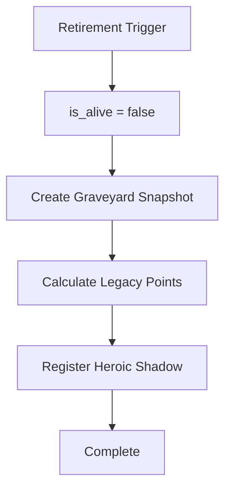

Code: Wirth-Dawn Specification v11.0 (Revised based on actual implementation)
# Retirement & Heroic Spirit System

## 1. 概要 (Overview)
キャラクターの引退、英霊（Heroic Spirit）システム、および次世代への資産継承を定義する。

---

## 2. 引退トリガー (Retirement Triggers)

### 2.1 自動引退 (Vitality Depletion)
- **条件**: `vitality <= 0`
- **原因文字列**: `'Vitality Depletion'`

### 2.2 自主引退 (Voluntary)
- **UI**: ステータス画面 (StatusModal) に「旅を終える（引退）」ボタンを配置。生存中（vitality > 0）であれば任意で実行可能。
- **API**: `POST /api/character/retire`
- **Body**: `{ cause: 'voluntary', heirloom_item_ids: string[], paid_gold_for_slots?: number }`
- **原因文字列**: `'Voluntary Retirement'`

---

## 3. 引退処理フロー (LifeCycleService.handleCharacterDeath)

```mermaid
flowchart TD
    Trigger["Retirement Trigger"] --> SetDead["is_alive = false"]
    SetDead --> Snapshot["Create Graveyard Snapshot"]
    Snapshot --> Legacy["Calculate Legacy Points"]
    Legacy --> RegisterHeroic["Register Heroic Shadow"]
    RegisterHeroic --> Done["Complete"]
```

### 3.1 墓地スナップショット (Graveyard Data)
引退/死亡時に以下のデータを保存:
- キャラクター名、レベル、年齢、クラス、ステータス
- 死因 (cause)
- 最終拠点、所持ゴールド
- 形見アイテムのID (`heirloom_item_ids`)

### 3.2 英霊登録 (Heroic Shadow Registration)
- `party_members` テーブルに `origin_type: 'shadow_heroic'` として挿入。
- **権限制御**: `subscription_tier` に応じた登録上限。

| subscription_tier | 英霊登録上限 |
|---|---|
| `free` | 最大 1体 |
| `basic` | 最大 3体 |
| `premium` | 最大 10体 |

- **上限到達時の処理 (FIFO方式)**: 上限に達している場合、最も古い自身の英霊（`created_at` 昇順の最初のレコード）を削除した上で新規登録を行う。
- ステータスは**固定** (frozen): 引退時のステータスが永続。
- **アバター引き継ぎ**: 引退時に `user_profiles.avatar_url` の値を `party_members.image_url` にコピーして保存する。酒場に残影が並ぶ際に使用される。

---

## 4. 継承システム (Succession)

### 4.1 API: POST /api/character/create (新キャラ作成時)
新キャラクター作成時（`/api/profile/init` 呼び出し）に `processInheritance()` が呼ばれ、前世代の遺産を引き継ぐ。

### 4.2 継承テーブル

| 資産 | 継承ルール | 備考 |
|---|---|---|
| ゴールド | Free: 50% / Basic: 100% / Premium: 100% | **上限キャップなし** |
| スキルカード | **100% 継承** (リセットなし) | 所持スキルはすべて次世代へそのまま引き継ぐ |
| 形見アイテム | Free: 最大10個 / Basic: 最大30個 / Premium: 最大50個 | インベントリおよび装備品から選択可能（全ティアで装備品継承可） |
| 名声 (各拠点) | 10% | サブスクリプション加入者のみ継承 |
| レベル / EXP | 0% | **Lv1からリスタート** |
| クエスト完了履歴 | 部分的 | メインシナリオ (`main_ep*`) のクリア記録のみ永続保持。それ以外は削除 |
| 訪問済み拠点 | リセット | 全拠点制覇トリガー等は世代ごとに1回のみ達成可能 |

### 4.3 継承ボーナスポイント（BP）の割り振り (手動ビルド調整)
前世代のキャラクターが稼いだレガシーポイント（LP）は、次世代作成時の能力底上げに使用できます。
- **BP換算公式**: 
  $$BP = \lfloor \frac{LP}{300} \rfloor$$
  - `Base_LP = (生存日数 × 10) + (最終レベル × 100)`
  - LP倍率: Free: 1.0倍 / Basic: 1.2倍 / Premium: 1.5倍
- **手動ステータス割り振り値 (1 BP あたり)**:
  - **HP**: +5
  - **ATK**: +1
  - **DEF**: +1
  - **最大VIT**: +2 （初期上限値 100 を超えて永続拡張可能）
- **反映**: キャラクタメイク画面（`title/page.tsx`）にてBP分配UIを表示し、`/api/profile/init` 時に割り振り数を送信。サーバー側でLP上限値を検証した上でステータスに適用。

---

## 5. 英霊の雇用保証 (My Heroic Spirits)
- 酒場（TavernModal）に「あなたの英霊」タブを新設。
- `party_members` から `owner_id = user_id` かつ `origin_type = 'shadow_heroic'` の非アクティブ（未雇用）な英霊を確実に直接雇用可能。
- **Premium特典**: `subscription_tier === 'premium'` のユーザーは、自身の英霊の雇用費用（`contract_fee`）が **50% OFF（半額）** となる。Free/BasicからPremiumへプランアップグレードした場合も、過去の英霊を含め自動的に50%割引が適用される。
