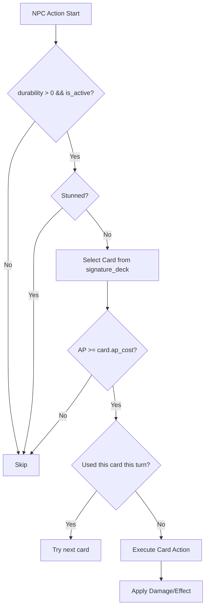

Code: Wirth-Dawn Specification v11.0 (Revised based on actual implementation)
# NPC / Shadow AI 仕様書 (Addendum to v2)

## 1. 概要 (Overview)
NPCおよびShadow（残影）がバトル中に自律的に行動するためのAIロジックを定義する。
AIは全て**クライアントサイド**（`gameStore.processPartyTurn()`）で実行される。

<!-- v11.0: processPartyTurn()の実装に合わせて全面改訂 -->

---

## 2. 基本原則

| 項目 | ルール | 実装 |
|---|---|---|
| 手札 | 固定 — シグネチャーデッキ (`signature_deck`) からランダム1枚選択 | `processPartyTurn()` 内で `Math.random()` による選択 |
| AP制約 | プレイヤーと同じAP制約に従う | `current_ap >= ap_cost` チェック |
| カード使用制限 | 1ターンにつき同一カード1回 | `used_this_turn` 配列で管理 |
| 行動不能 | Stun状態の場合はスキップ | `isStunned()` チェック |
| 死亡 | `durability <= 0` で行動不能 | `is_active: false` |

---

## 3. ロール分類 (Role Definition)
<!-- v11.0: determineRole()の実装に準拠 -->

ロールは**デッキ内容から動的に判定**される（DBにはロール情報を保存しない）。

| Role | 判定条件 | 優先行動 |
|---|---|---|
| `guardian` | デッキに防御系カード（`def_up`, `Shield`系）が50%以上 | 防御/バフ優先 |
| `medic` | デッキに回復系カード（`regen`, `Heal`系）が存在 | 回復/バフ優先 |
| `striker` | 上記に該当しない | 攻撃優先 |

### 3.1 グレード (AI Grade)
<!-- v11.0: determineGrade()の実装に準拠 -->
- `smart`: Heroic Shadow（英霊）および特殊NPC → 効率的なスキル選択。
- `random`: 通常NPC → ランダム選択。

```typescript
function determineGrade(pm: PartyMember): 'smart' | 'random' {
  if (pm.origin_type === 'shadow_heroic') return 'smart';
  return 'random';
}
```

---

## 4. AI行動フロー (Decision Flow)
<!-- v11.0: processPartyTurn()の実装フローを反映 -->



### 4.1 カード選択ロジック
1. `signature_deck` からランダムに1枚を候補として選出。
2. AP不足の場合 → 行動スキップ。
3. `used_this_turn` に含まれている場合 → 別の候補を再選出。
4. 有効なカードが見つからない場合 → 行動スキップ。

### 4.2 ターゲット選択
<!-- v11.0: processPartyTurn()のターゲットロジックを反映 -->
- **攻撃カード**: 最初の生存敵に対して実行。
- **バフ/回復カード（self系）**: 自身に対して実行。

---

## 5. パーティメンバー型定義
<!-- v11.0: types/game.ts の PartyMember を反映 -->
```typescript
export interface PartyMember {
  id: string;
  owner_id: string;
  name: string;
  gender: 'Male' | 'Female' | 'Unknown';
  origin: 'system' | 'ghost';
  origin_type?: string;        // 'system_mercenary', 'shadow_heroic', 'active_shadow'
  job_class: string;
  durability: number;
  max_durability: number;
  def?: number;
  cover_rate: number;          // 0-100: 庇う確率
  loyalty: number;
  inject_cards: string[];      // Card IDs
  passive_id?: string;
  is_active: boolean;

  // AI Fields (runtime only, not persisted)
  ai_role?: 'striker' | 'guardian' | 'medic';
  ai_grade?: 'smart' | 'random';
  current_ap?: number;
  signature_deck?: Card[];
  used_this_turn?: string[];
  status_effects?: { id: string; duration: number }[];
}
```

---

## 6. 実装上の制約と今後の課題

| 項目 | 現状 | 仕様上の理想 |
|---|---|---|
| Heroicの溜め行動 | 未実装 | AP温存して次ターンに高コストスキル使用 |
| Smart AIの戦略判定 | ランダム選択と同等 | 敵HPに応じた最適スキル選択 |
| Medic の HP 監視 | 未実装 | プレイヤーHP閾値で自動回復 |