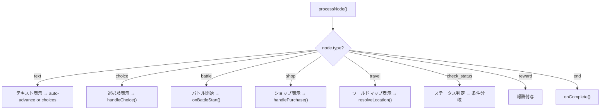

Code: Wirth-Dawn Specification v11.0 (Revised based on actual implementation)
# Quest Structure & Scenario Engine

## 1. 概要 (Overview)
本仕様書は、クエスト（依頼）のデータ構造と出現ロジック、シナリオエンジンの基本的なフローを定義する。

<!-- v11.0: scenariosテーブルベースの実装に合わせて改訂。CSV/DBデータ構造を反映。 -->

---

## 2. クエスト種別

| 種別 | key | 特徴 |
|---|---|---|
| 通常依頼 | `normal` | その拠点の日常的な依頼。難易度低～中。 |
| 特殊依頼 | `special` | 物語的要素が強い依頼。連続クエストの可能性あり。 |

---

## 3. データ構造

### 3.1 scenarios テーブル
<!-- v11.0: 実装ではquestsテーブルではなくscenariosテーブルを使用 -->
```sql
CREATE TABLE scenarios (
  id UUID DEFAULT gen_random_uuid() PRIMARY KEY,
  slug TEXT UNIQUE,
  title TEXT NOT NULL,
  quest_type TEXT DEFAULT 'normal',   -- 'normal' | 'special'
  location_id UUID REFERENCES locations(id),
  difficulty INT DEFAULT 1,
  rewards JSONB,                       -- { exp: number, gold: number, items?: [...] }
  days_success INT DEFAULT 1,
  days_failure INT DEFAULT 1,
  flow JSONB,                          -- シナリオノードの木構造
  description TEXT,
  required_level INT DEFAULT 1,
  required_reputation INT DEFAULT 0
);
```

### 3.2 シナリオノード構造 (flow JSONB)
<!-- v11.0: ScenarioEngine.tsx の processNode() に準拠 -->
`flow` カラムにはツリー構造のノードデータが格納される。

```typescript
interface ScenarioNode {
  id: string;
  type: 'text' | 'choice' | 'battle' | 'shop' | 'travel' | 'check_status' | 'reward' | 'end';
  text?: string;
  speaker?: string;
  background?: string;
  choices?: { label: string; next: string; condition?: any }[];
  enemy_slug?: string;
  success_node?: string;
  failure_node?: string;
  reward?: { gold?: number; exp?: number; items?: any[] };
  location_slug?: string;
}
```

### 3.3 CSVデータファイル
<!-- v11.0: src/data/csv/ 配下のファイル群を記載 -->
| ファイル | 用途 |
|---|---|
| `quests_normal.csv` | 通常クエストのシードデータ |
| `quests_special.csv` | 特殊クエストのシードデータ |
| `scenario_nodes.csv` | シナリオノードのシードデータ |
| `scenario_choices.csv` | 選択肢のシードデータ |

---

## 4. クエスト出現ロジック (Appearance Logic)

### 4.1 拠点ベースのフィルタ
<!-- v11.0: QuestService.fetchAvailableQuests() を反映 -->
```typescript
class QuestService {
  static async fetchAvailableQuests(userId: string, locationId: string) {
    const { data } = await supabase
      .from('scenarios')
      .select('*')
      .eq('location_id', locationId);
    return data || [];
  }
}
```

> **Note (v11.0)**: 現在の実装では、`required_level` や `required_reputation` によるフィルタリングは未実装。全クエストが拠点IDのみでフィルタされる。

---

## 5. クエスト進行状態 (Quest State)
<!-- v11.0: useQuestState.ts を正として反映 -->

```typescript
interface QuestProgressState {
  isInQuest: boolean;
  questId: string | null;
  questType: 'normal' | 'special' | null;

  playerHp: number;
  playerMaxHp: number;
  partyHp: Record<string, number>;   // npc_id -> current HP
  deadNpcs: string[];

  guest: PartyMember | null;          // v3.4: ゲストNPC
  currentLocationId: string | null;   // v3.4: クエスト内現在地
  elapsedDays: number;                // v3.4: 経過日数

  lootPool: LootItem[];              // at-risk: 敗北時全ロスト
  consumedItems: string[];
}
```

### 5.1 永続化ルール

| アクション | メソッド | 効果 |
|---|---|---|
| クエスト開始 | `startQuest()` | 全ステートの初期化、HP記録 |
| バトル後更新 | `updateAfterBattle()` | HP引き継ぎ、NPC死亡記録、ルート蓄積 |
| クエスト完了 | `finalizeQuest('success')` | ルートを返却、state リセット |
| クエスト失敗 | `finalizeQuest('failure')` | **ルート全消滅**、state リセット |
| 移動 | `travelTo(destId, days)` | 現在地更新、経過日数加算 |
| ゲスト追加 | `addGuest(guest)` | パーティに一時メンバー追加 |
| 回復 | `healParty(percentage)` | プレイヤーHPを割合回復 |
| 中断復帰 | `resumeQuest(savedState)` | 保存されたステートから復元 |

---

## 6. シナリオエンジン (ScenarioEngine)
<!-- v11.0: ScenarioEngine.tsx の実装を反映 -->

### 6.1 ノード処理フロー


### 6.2 travel ノードの解決
<!-- v11.0: resolveLocation()の実装を反映 -->
1. ワールドマップを表示し、プレイヤーに目的地を選択させる。
2. `POST /api/travel/cost` で隣接判定と移動日数を取得。
3. `useQuestState.travelTo(destId, days)` で内部状態を更新。

---

## 7. クエスト完了処理 (Quest Complete API)
<!-- v11.0: POST /api/quest/complete の実装を反映 -->

**API**: `POST /api/quest/complete`

### 7.1 処理フロー
1. **クエストデータ取得**: `scenarios` テーブルから取得。
2. **ユーザーデータ取得**: `user_profiles` テーブルから取得。
3. **加齢処理**: `processAging()` — 経過日数に基づく年齢・老化計算（詳細: v9仕様）。
4. **EXP加算 & レベルアップ**: `calculateGrowth()` — 成長計算（詳細: v8仕様）。
5. **報酬付与**: `quest.rewards` の金額・EXP・アイテムをプロフィールに反映。
6. **Vitality枯渇チェック**: Vitality 0 到達時は引退/死亡フラグ。
