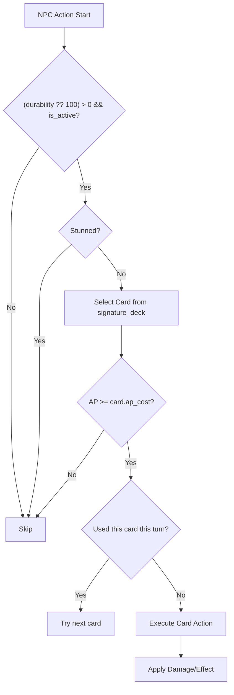

Code: Wirth-Dawn Specification v13.0 (Revised based on actual implementation)
# NPC / Shadow AI 仕様書 (Addendum to v2)

## 1. 概要 (Overview)
NPCおよびShadow（影の残像）がバトル中に自動的に行動するためのAIロジックを定義する。
AIは全て**クライアントサイド**（`gameStore.processPartyTurn()`）で実行される。

<!-- v13.0: startBattle時のdurability正規化、resolveNpcTurn null-safe guard追加 -->
<!-- v12.0: v3.3の heal action / durability更新 / HPバー同期対応 -->

---

## 2. 基本規則

| 項目 | ルール | 実装 |
|---|---|---|
| 行動 | 固定・シグネチャデッキ (`signature_deck`) からランダムに1枚ずつ選出 | `processPartyTurn()` 内で `Math.random()` による選出 |
| AP制約 | プレイヤーと同じAP制約に従う | `current_ap >= ap_cost` チェック |
| カード使用制限 | 1ターンにつき同一カード1枚 | `used_this_turn` 配列で管理 |
| 行動不能 | Stun状態の場合はスキップ | `isStunned()` チェック |
| 死亡 | `durability <= 0` で行動不能 | `is_active: false` |

---

## 3. ロールと定義 (Role Definition)
<!-- v11.0: determineRole()の実装に基づく -->

ロールは**デッキ内容から動的に決定**される（DBにはロール情報を保存しない）。

| Role | 決定条件 | 優先行動 |
|---|---|---|
| `guardian` | `def >= 3` または `cover_rate >= 30` | 防御/バフ優先 |
| `medic` | デッキに回復系カード（`regen`, `Heal`系, `type: 'Heal'`）が存在 | 回復/バフ優先 |
| `striker` | 上記に該当しない | 攻撃一択 |

### 3.1 グレード (AI Grade)
<!-- v11.0: determineGrade()の実装に基づく -->
- `smart`: Heroic Shadow（英雄格）および特定NPC → 効率的なスキル選択
- `random`: 通常NPC → ランダム選択

```typescript
function determineGrade(pm: PartyMember): 'smart' | 'random' {
  if (pm.origin_type === 'shadow_heroic') return 'smart';
  return 'random';
}
```

---

## 4. AI行動フロー (Decision Flow)
<!-- v13.0: null-safe durability guard 反映 -->



### 4.1 カード選択ロジック

**`random` グレード:**
1. `signature_deck` からランダムに1枚を優先的に選出。
2. AP不足の場合 → 行動スキップ。
3. `used_this_turn` に含まれている場合 → 別のカードを再選出。
4. 有効なカードが見つからない場合 → 行動スキップ。

**`smart` グレード（英雄・特殊NPC）:**
1. **緊急回復チェック**: プレイヤー or 味方の HP が50%以下 → 先頭の回復系カードを優先使用。
2. **AP貯蓄判断**: 高コストスキル（AP≥ 5）があり AP不足する場合 → 行動を「スキップ」し次ターンに向けてAPを貯蓄。
3. APを使い切れる限り、高コスト順にカードを使用。
実装: `npcAI.ts` 内の `evaluateWaitLogic()` および `tryEmergencyHeal()`。

### 4.2 ターゲット選択
<!-- v11.0: processPartyTurn()のターゲットロジックを反映 -->
- **攻撃カード**: 最初の生存敵に対して実行。
- **バフ/回復カード (self系)**: 自身に対して実行。

### 4.3 heal action の詳細 (v3.3+)

`action.type === 'heal'` の場合：

| `action.targetName` | HP変更 | HPバー同期 |
|---|---|---|
| `'あなた'` | プレイヤーの `userProfile.hp` に `healAmount` を加算 | `__hp_sync:NNN` マーカーを `messages` に追加 |
| その他（member.name等） | `updatedParty[idx].durability` に `healAmount` を加算（max_durability上限） | `__party_sync:ID:NNN` マーカーを `messages` に追加 |

---

## 5. バトル開始時の初期化 (Battle Initialization)
<!-- v13.0: startBattle時のdurability正規化を追加 -->

### 5.1 Durability 正規化（重要）

`startBattle()` 実行時、`party/list` API から取得したパーティメンバーの `durability` を **max_hp に正規化**する。

**理由**: DB の `party_members.durability` には前回バトルでのダメージ残留値が保存されている場合があり、そのまま使用するとメンバーが「戦闘不能」として扱われてしまう不具合が発生する（`durability = 0` かつ `is_active = true` の DB 不整合状態）。

```typescript
// startBattle 内のパーティマッピング
const fullHp = (pm as any).max_hp || (pm as any).hp || pm.max_durability || pm.durability || 100;
return {
    ...pm,
    durability: fullHp,       // ← バトル開始時に満HP でリセット
    max_durability: fullHp,   // ← max 値も正規化
    signature_deck: sigDeck,
    current_ap: 5,
    used_this_turn: [],
};
```

### 5.2 Durability Null-Safe Guard

`resolveNpcTurn()` 内の生存チェックでは `null` / `undefined` に対して `?? 100` でフォールバックする。

```typescript
// npcAI.ts
if (!npc.is_active || (npc.durability ?? 100) <= 0) return actions;
```

> **注意**: `null <= 0` は JavaScript で `true` と評価されるため、null-safe処理なしでは有効なメンバーが誤ってスキップされる。

---

## 6. パーティメンバー型定義
<!-- v11.0: types/game.ts の PartyMember を反映 -->
```typescript
export interface PartyMember {
  id: string;
  owner_id: string;
  name: string;
  gender: 'Male' | 'Female' | 'Unknown';
  origin: 'system' | 'ghost';
  origin_type?: string;        // 'system_mercenary', 'shadow_heroic', 'active_shadow'
  job_class: string;
  durability: number;          // バトル中の現在HP（開始時に max_hp で上書きされる）
  max_durability: number;      // バトル中の最大HP
  def?: number;
  cover_rate: number;          // 0-100: 庇う確率
  loyalty: number;
  inject_cards: string[];      // Card IDs
  passive_id?: string;
  is_active: boolean;

  // AI Fields (runtime only, not persisted)
  ai_role?: 'striker' | 'guardian' | 'medic';
  ai_grade?: 'smart' | 'random';
  current_ap?: number;
  signature_deck?: Card[];
  used_this_turn?: string[];
  status_effects?: { id: string; duration: number }[];
}
```

---

## 7. 実装上の制約と注意事項

| 項目 | 実装状況 |
|---|---|
| Heroicの貯め行動 | ✅ **実装済み** (`evaluateWaitLogic()`) |
| Smart AIの戦略決定 | ✅ **実装済み** (`resolveNpcTurn()` AP順・高コスト優先) |
| Medic の HP 逼迫 | ✅ **実装済み** (`tryEmergencyHeal()`) |
| パーティメンバーへのheal時 durability 更新 | ✅ **実装済み** (v3.3) |
| heal によるHPバーリアルタイム同期 | ✅ **実装済み** (v3.3: `__hp_sync` / `__party_sync` マーカー) |
| startBattle時のdurability正規化 | ✅ **実装済み** (v13.0) |
| resolveNpcTurn の null-safe durability guard | ✅ **実装済み** (v13.0) |

---

## 8. 変更履歴

| バージョン | 日付 | 主な変更内容 |
|---|---|---|
| v11.0 | 2026-04 | processPartyTurn()の実装に合わせて全面改訂 |
| v12.0 | 2026-04-12 | v3.3対応: heal actionのdurability更新修正・HPバー同期マーカー追加 |
| **v13.0** | **2026-04-13** | **startBattle時のdurability正規化・resolveNpcTurnのnull-safe guard追加。文字コードをUTF-8に修正** |
