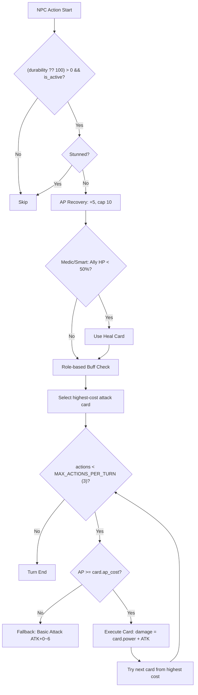

Code: Wirth-Dawn Specification v4.1 (NPC AI v4.1 2026-05-16)
# NPC / Shadow AI 仕様書 (Addendum to v2)

## 1. 概要 (Overview)
NPCおよびShadow（影の残像）がバトル中に自動的に行動するためのAIロジックを定義する。
AIは全て**クライアントサイド**（`battleSlice.processPartyTurn()` / 旧: `gameStore.processPartyTurn()`）で実行される。
<!-- v4.1 (2026-05-16): Smart AI 2枚/ターン・瀕死ターゲット優先・レガシースキル(AP付与パッシブ) -->
<!-- v4.0 (2026-05-15): 攻撃1枚/ターン制限・lastUsedCardId連打防止・ダメージ揺らぎ+ミス+クリティカル・デバフカード使用・ロール別ヒール閾値 -->
<!-- v2.8.1 (2026-04-17): 行動上限(3)追加・ミッドターンリターゲット・ゴールド反映修正 -->
<!-- v2.8 (2026-04-17): 同一カード制限撤廃・ATK基礎値追加・基本攻撃式変更 -->
<!-- v15.0: フェーズ制バトルフロー導入 -->
<!-- v14.0: ターン進行順序正規化・NPCステータス取得優先順位確定・npcsテーブルHP列廃止 -->
<!-- v13.0: startBattle時のdurability正規化、resolveNpcTurn null-safe guard追加 -->
<!-- v12.0: v3.3の heal action / durability更新 / HPバー同期対応 -->
<!-- v2.7 (2026-04-15): バトルログに対象（エネミー名/パーティメンバー名）を追加 -->

---

## 2. 基本規則

| 項目 | ルール | 実装 |
|---|---|---|
| 行動 | シグネチャデッキ (`signature_deck`) からフェーズ順に行動 | `resolveNpcTurn()` 内 |
| AP制約 | 毎ターン+5（上限10）。カード使用時にap_costを消費 | `current_ap >= ap_cost` チェック |
| **攻撃カード** | **Random AI: 1枚/ターン、Smart AI: 2枚/ターン（v4.1）** | 高コスト順に選択。Smart は異なるカードで2枚まで |
| **連打防止** | **直前ターンに使用した攻撃カードは次ターンで使用不可（v4.0）** | `lastUsedCardId` で追跡。次ターンにリセット |
| **行動上限** | **1ターンあたり最大3アクション（v2.8.1）** | `MAX_ACTIONS_PER_TURN = 3`（ヒール・バフ・デバフ・攻撃の合計） |
| ATK基礎値 | NPCのATK（`npcs.attack`）がカードダメージ・基本攻撃に加算される | `npc.atk \|\| 0` |
| 基本攻撃 | 攻撃カードが使えなかった場合のフォールバック: `ATK + 0〜6` | `createBasicAttack()` |
| 行動不能 | Stun状態の場合はスキップ | `isStunned()` チェック |
| 死亡 | `durability <= 0` で行動不能 | `is_active: false` |

---

## 3. ロールと定義 (Role Definition)
<!-- v11.0: determineRole()の実装に基づく -->

ロールは**デッキ内容から動的に決定**される（DBにはロール情報を保存しない）。

| Role | 決定条件 | 優先行動 |
|---|---|---|
| `guardian` | `def >= 3` または `cover_rate >= 30` | 防御/バフ優先 |
| `medic` | デッキに回復系カード（`regen`, `Heal`系, `type: 'Heal'`）が存在 | 回復/バフ優先 |
| `striker` | 上記に該当しない | 攻撃一択 |

### 3.1 グレード (AI Grade)
<!-- v11.0: determineGrade()の実装に基づく -->
- `smart`: Heroic Shadow（英雄格）および特定NPC → 効率的なスキル選択、**2枚攻撃/ターン**、**瀕死ターゲット優先**
- `random`: 通常NPC → ランダム選択、1枚攻撃/ターン

```typescript
function determineGrade(pm: PartyMember): 'smart' | 'random' {
  if (pm.origin_type === 'shadow_heroic') return 'smart';
  return 'random';
}
```

---

## 4. ターン進行フロー (Turn Sequence)
<!-- v14.0: ターン番号更新タイミングをエネミーターン完了後に変更 -->

### 4.1 正しいターン進行順序

```
[プレイヤー] ターンエンドボタン押下
  ↓
endTurn():
  - 状態異常Tick処理（毒ダメージ等）
  - AP回復
  - ターン番号は据え置き（まだ更新しない）
  ↓
processPartyTurn():
  - 生存NPC全員が順番に行動（カード使用・攻撃・回復）
  ↓
processEnemyTurn():
  - 全エネミーが行動
  - エネミーターン完了後 → turn: N+1 に更新
  - "--- ターン N+1 ---" をログに追加
  - dealHand() で次のターンの手札配布
```

> **重要**: プレイヤーのターンエンド直後にターン番号を更新してはならない。
> NPC・エネミー全員の行動が完了した後に初めてターンが切り替わる。

### 4.2 AI行動フロー (Decision Flow)
<!-- v13.0: null-safe durability guard 反映 -->



### 4.3 カード選択ロジック（v4.0）

**ターン内行動順序:**
1. **緊急回復チェック** → ロール別閾値に基づく回復判定
2. **AP貯蓄判断** (Smart AIのみ) → 高コストスキルのためにスキップ
3. **ロール別バフ使用** → Striker=atk_up / Medic=regen,def_up / Guardian=def_up,taunt
4. **敵デバフ使用 (v2.9.3j)** → stun/bind/blind/atk_down等を敵に付与
5. **攻撃カード1枚使用** → 高コスト順の最初のAP可能カード
6. **基本攻撃フォールバック** → 攻撃アクションが0件なら `ATK + 0〜6`

**攻撃カード選択ルール (v4.0):**
- 攻撃カード（Skill/Magic型 + 敵対象の Defense/Support型）を高コスト順にソート
- `lastUsedCardId` と一致するカードを除外（直前ターンの連打防止）
- APが足りる最高コストカード1枚を使用
- 使用不可なら `lastUsedCardId` をリセットし、基本攻撃にフォールバック

**緊急回復チェック（v4.0: ロール別閾値）:**

| ロール | 閾値 | 定数 |
|---|---|---|
| Medic | 味方HPが70%以下で発動 | `HEAL_THRESHOLD_MEDIC = 0.70` |
| Smart (Heroic) | 味方HPが50%以下で発動 | `HEAL_THRESHOLD_SMART = 0.50` |
| Striker/Guardian | 味方HPが40%以下で発動 | `HEAL_THRESHOLD_DEFAULT = 0.40` |

- 回復カードの選択時、欠損HPに対してオーバーヒールが大きすぎる場合はスキップ（無駄な回復の抑制）

**`smart` グレード（英雄・特殊NPC）追加ルール:**
1. **AP貯蓄判断**: 高コストスキル（AP≥ 5）があり AP不足する場合 → 行動を「スキップ」し次ターンに向けてAPを貯蓄。
2. **クリティカル率上昇**: `NPC_HIGH_GRADE_CRIT_RATE = 0.08`（通常NPC: `0.05`）

### 4.3.1 NPCダメージ計算（v4.0）

```
// ──── カード攻撃 ────
// 1. ミス判定（5%）
if (random() < NPC_MISS_RATE)  → ミス（ダメージ0）

// 2. 基礎ダメージ
BaseDamage = Card.power + NPC.ATK

// 3. ダメージ揺らぎ（±15%）
Variance = random(0.85, 1.15)     // DAMAGE_VARIANCE_MIN ~ MAX
Damage = BaseDamage × Variance

// 4. クリティカル判定
CritRate = (ai_grade === 'smart') ? 0.08 : 0.05
if (random() < CritRate)  → Damage × 1.5  // CRIT_MULTIPLIER

// 5. DEF減算（魔法は貫通）
if (!isMagic)  Damage = Damage - Enemy.DEF
FinalDamage = max(1, floor(Damage))

// ──── 基本攻撃（カード使用不可時のフォールバック）────
BaseDamage = NPC.ATK + random(0, 6)
// 以降は同じ: 揺らぎ → クリティカル → DEF減算 → max(1, floor)
```

### 4.3.2 敵デバフカード使用（v2.9.3j）

- NPCが `stun`, `bind`, `blind`, `blind_minor`, `atk_down`, `freeze`, `poison`, `curse` 等の `effect_id` を持ち、かつ `target_type` が敵対象（`single_enemy`/`all_enemies`/`random_enemy`）のカードを使用
- 既に敵に付与済みのデバフは除外（重複回避）
- ダメージ付きデバフ（`power > 0`）は攻撃として処理される

実装: `npcAI.ts` 内の `executeCard()`, `createBasicAttack()`, `evaluateWaitLogic()`, `tryEmergencyHeal()`, `tryRoleBasedBuff()`, `tryDebuffEnemy()`。

**定数一覧** (`src/constants/battle_rules.ts`):

| 定数 | 値 | 用途 |
|---|---|---|
| `DAMAGE_VARIANCE_MIN` / `MAX` | 0.85 / 1.15 | ダメージ揺らぎ範囲 |
| `NPC_MISS_RATE` | 0.05 | NPCのミス率 |
| `NPC_CRIT_RATE` | 0.05 | NPC通常クリティカル率 |
| `NPC_HIGH_GRADE_CRIT_RATE` | 0.08 | Smart AIクリティカル率 |
| `CRIT_MULTIPLIER` | 1.5 | クリティカル倍率 |
| `HEAL_THRESHOLD_MEDIC` | 0.70 | Medicの回復発動閾値 |
| `HEAL_THRESHOLD_SMART` | 0.50 | Smart AIの回復発動閾値 |
| `HEAL_THRESHOLD_DEFAULT` | 0.40 | その他ロールの回復発動閾値 |

### 4.4 ターゲット選択
<!-- v11.0: processPartyTurn()のターゲットロジックを反映 -->
<!-- v2.8.1: ミッドターンリターゲット追加 -->
- **攻撃カード**: 現在のターゲット敵に対して実行。
- **バフ/回復カード (self系)**: 自身に対して実行。

#### ミッドターンリターゲット (v2.8.1)
NPCの攻撃によりターゲット敵のHPが0以下になった場合:
1. `trackedEnemies` 配列から次の生存敵を検索
2. 生存敵がいれば即座にリターゲット（`currentTargetId` / `enemyHp` / `enemyDef` を更新）
3. 後続NPCは新ターゲットに対して行動を継続
4. 全敵が死亡している場合のみNPCループを終了

> **v2.8.1以前**: ターゲット死亡時に全NPCのループが即座に終了し、後続NPCが行動不能になる問題があった。

### 4.5 heal action の詳細 (v3.3+)

`action.type === 'heal'` の場合：

| `action.targetName` | HP変更 | HPバー同期 |
|---|---|---|
| `'あなた'` | プレイヤーの `userProfile.hp` に `healAmount` を加算 | `__hp_sync:NNN` マーカーを `messages` に追加 |
| その他（member.name等） | `updatedParty[idx].durability` に `healAmount` を加算（max_durability上限） | `__party_sync:ID:NNN` マーカーを `messages` に追加 |

---

## 5. バトルログ仕様 (v2.7) — 対象名の明示
<!-- v2.7 (2026-04-15): NPC/エネミー攻撃ログに対象名を追加 -->

### 5.1 NPCターンのログフォーマット

NPCの攻撃・サポートアクションは、**「誰が」「何のスキルで」「どの対象に」「何ダメージ/回復」**を一行で表現する。

| アクション種別 | ログフォーマット例 |
|---|---|
| 攻撃（スキルあり） | `田中の『烈風斬』！ → ゴブリンに 45 のダメージ！` |
| 攻撃（基本） | `田中の援護攻撃！ → ゴブリンに 20 のダメージ！` |
| 回復（プレイヤー対象） | `マリアの癒しの光！ あなたのHPが 30 回復した。` |
| バフ | `田中の強化！ 田中に効果が発動した。` |

**実装:** `npcAI.ts` の `executeCard()` / `createBasicAttack()` にて `context.enemyName` を参照。

```typescript
// NpcAction に targetEnemyName フィールドを追加 (v2.7)
export interface NpcAction {
    type: 'attack' | 'heal' | 'pass' | 'buff';
    targetEnemyName?: string; // 攻撃対象エネミー名
    // ...
    message: string;
}

// BattleContext に enemyName フィールドを追加 (v2.7)
export interface BattleContext {
    enemyName: string; // ダメージ対象エネミー名
    // ...
}
```

### 5.2 エネミーターンのログフォーマット

エネミーの攻撃は、スキル名と対象（プレイヤー or パーティメンバー）を一行に統合する。

| 状況 | ログフォーマット例 |
|---|---|
| プレイヤーへの通常攻撃 | `ゴブリンの『攻撃』！ → あなたに 25 ダメージ (HP: 80 → 55)` |
| プレイヤーへのスキル攻撃 | `ドラゴンの『炎の息』！ → あなたに 60 ダメージ (DEF -10) (HP: 80 → 20)` |
| パーティへの攻撃 | `ゴブリンの『攻撃』！ → 田中に 30 ダメージ (HP: 100 → 70)` |
| かばい | `ゴブリンの『攻撃』！ → 田中がかばった！ 30 ダメージ (HP: 100 → 70)` |
| 自己回復スキル | `ゴブリンの『回復の息吹』！ → 自身の HP 50 回復！` |

**実装:** `battleSlice.ts` の `processEnemyTurn()` にて `selectedSkillName` 変数でスキル名を保持し、
`routeDamage()` で対象確定後に一本化したメッセージを生成する。

---

## 6. バトル開始時の初期化 (Battle Initialization)
<!-- v14.0: HP取得優先順位確定・npcsテーブルカラム廃止反映 -->

### 5.1 NPCのHP取得優先順位（確定版）

NPC最大HPは以下の優先順位で取得する：

```
1. party_members.max_durability  （hire時スナップショット。100以外の値が入っている場合）
2. npcs.max_hp                   （npcsマスタの個別上限HP）
3. 100                           （フォールバック）
```

**実装（`startBattle()` 内）:**
```typescript
// party_members.max_durability を最優先（hire時スナップショット）
const pmAny = pm as any;
const fullHp = pm.max_durability || pmAny.max_hp || pm.durability || 100;
```

**実装（`party/list` API 内）:**
```typescript
const rawMaxDur = member.max_durability;
const npcHp = npc?.max_hp ?? null;
// max_durabilityが100以外（=個別設定済み）ならそれを優先、なければnpcsのmax_hpを使用
const resolvedHp = (rawMaxDur && rawMaxDur !== 100)
    ? rawMaxDur
    : (npcHp ?? member.durability ?? 100);
```

### 5.2 npcsテーブルのHP関連カラム（廃止・存続）

| カラム | 状態 | 説明 |
|---|---|---|
| `npcs.max_hp` | ✅ **使用中** | 各NPC個別の正しい上限HP（マスタ設定値） |
| `npcs.hp` | ❌ **廃止** | 50固定のデフォルト値。2026-04-14に削除 |
| `npcs.max_durability` | ❌ **廃止** | 100固定のDBデフォルト値。2026-04-14に削除 |
| `npcs.durability` | ⚠️ **非推奨** | 現在HPとして使用予定だったが実際は100固定。参照回避 |
| `party_members.max_durability` | ✅ **使用中** | hire時のNPC HPスナップショット。バトルのHP源泉 |

### 5.3 雇用時（hire）のスナップショット保存

酒場でNPCを雇用する際、`shadowService.hireShadow()` が以下の順でHP値を取得し `party_members.max_durability` に保存する：

```typescript
// generateSystemMercenaries() 内（shadowService.ts）
stats: { hp: npc.max_hp || 100 }  // npcs.max_hp を使用

// hireShadow() 内
const snapshotHp = shadow.stats?.hp || 100;
durability: snapshotHp,
max_durability: snapshotHp,  // party_membersに保存
```

### 5.4 Durability Null-Safe Guard

`resolveNpcTurn()` 内の生存チェックでは `null` / `undefined` に対して `?? 100` でフォールバックする。

```typescript
// npcAI.ts
if (!npc.is_active || (npc.durability ?? 100) <= 0) return actions;
```

> **注意**: `null <= 0` は JavaScript で `true` と評価されるため、null-safe処理なしでは有効なメンバーが誤ってスキップされる。

---

## 6. パーティメンバー型定義
<!-- v14.0: atk/defフィールド追加 -->
```typescript
export interface PartyMember {
  id: string;
  owner_id: string;
  name: string;
  gender: 'Male' | 'Female' | 'Unknown';
  origin: 'system' | 'ghost';
  origin_type?: string;        // 'system_mercenary', 'shadow_heroic', 'active_shadow'
  job_class: string;
  durability: number;          // バトル中の現在HP（開始時に max_durability/max_hp で上書き）
  max_durability: number;      // hire時にスナップショットされた最大HP
  atk?: number;                // 基礎攻撃力
  def?: number;                // 基礎防御力
  cover_rate: number;          // 0-100: 庇う確率
  loyalty: number;
  inject_cards: string[];      // Card IDs
  passive_id?: string;
  is_active: boolean;

  // AI Fields (runtime only, not persisted)
  ai_role?: 'striker' | 'guardian' | 'medic';
  ai_grade?: 'smart' | 'random';
  current_ap?: number;
  signature_deck?: Card[];
  used_this_turn?: string[];
  status_effects?: { id: string; duration: number }[];
}
```

---

## 7. 実装上の制約と注意事項

| 項目 | 実装状況 |
|---|---|
| Heroicの貯め行動 | ✅ **実装済み** (`evaluateWaitLogic()`) |
| Smart AIの戦略決定 | ✅ **実装済み** (`resolveNpcTurn()` AP順・高コスト優先) |
| Medic の HP 逼迫 | ✅ **実装済み** (`tryEmergencyHeal()`) |
| パーティメンバーへのheal時 durability 更新 | ✅ **実装済み** (v3.3) |
| heal によるHPバーリアルタイム同期 | ✅ **実装済み** (v3.3: `__hp_sync` / `__party_sync` マーカー) |
| startBattle時のdurability正規化 | ✅ **実装済み** (v14.0: max_durability優先) |
| resolveNpcTurn の null-safe durability guard | ✅ **実装済み** (v13.0) |
| ターン番号更新タイミング | ✅ **修正済み** (v14.0: エネミーターン完了後に更新) |
| npcsテーブルHP列廃止 (hp / max_durability) | ✅ **DB変更済み** (2026-04-14) |
| バトルログに対象名（エネミー名/パーティメンバー名）を含める | ✅ **実装済み** (v2.7: 2026-04-15) |
| 1ターン行動上限 (MAX_ACTIONS_PER_TURN = 3) | ✅ **実装済み** (v2.8.1) |
| ミッドターンリターゲット | ✅ **実装済み** (v2.8.1: trackedEnemiesで全敵HP追跡) |
| 酒場雇用後のゴールド即時反映 | ✅ **修正済み** (v2.8.1: TavernModal.handleHire) |

---

## 8. 変更履歴

| バージョン | 日付 | 主な変更内容 |
|---|---|---|
| v11.0 | 2026-04 | processPartyTurn()の実装に合わせて全面改訂 |
| v12.0 | 2026-04-12 | v3.3対応: heal actionのdurability更新修正・HPバー同期マーカー追加 |
| v13.0 | 2026-04-13 | startBattle時のdurability正規化・resolveNpcTurnのnull-safe guard追加 |
| **v14.0** | **2026-04-14** | **ターン進行順序正規化（エネミー完了後にターン番号更新）・NPCのHP取得優先順位確定（party_members.max_durability → npcs.max_hp）・npcsテーブルhp/max_durabilityカラム廃止反映** |
| v15.0 | 2026-04-15 | フェーズ制バトルフロー（player/npc_done/enemy_done）導入。endTurn→runNpcPhase に改名。setTimeout連鎖廃止 |
| **v1.0 refactor** | **2026-04-15** | **コードリファクタリング。processPartyTurn を含む全バトルアクションを `src/store/slices/battleSlice.ts` に移動。** |
| **v2.7** | **2026-04-15** | **バトルログに対象名を追加。`NpcAction.targetEnemyName` / `BattleContext.enemyName` フィールド追加。** |
| **v2.8** | **2026-04-17** | **ATK基礎値のNPCダメージ加算を正式化。基本攻撃式を `ATK + 0~6` に変更。** |
| **v2.8.1** | **2026-04-17** | **1ターン行動上限 `MAX_ACTIONS_PER_TURN = 3` 追加。ミッドターンリターゲット実装。** |
| **v2.9.3j** | **2026-04** | **敵デバフカード使用（stun/bind/blind/atk_down等）。ロール別バフ優先使用。デバフ重複回避。** |
| **v4.0** | **2026-05-15** | **攻撃カード1枚/ターン制限。`lastUsedCardId`連打防止。ダメージ計算に揺らぎ(±15%)・ミス(5%)・クリティカル(5%/8%)を導入。ロール別ヒール閾値(Medic70%/Smart50%/Default40%)。`battle_rules.ts`に定数一元管理。** |
| **v4.3** | **2026-06-21** | **NPC行動選択制限を追加。不具合や矛盾を引き起こす28枚の特殊カード（既存10種＋魔術学院18種）を AI の選択肢から除外。** |


## 9. NPC行動選択制限 (特殊カード除外) (v4.3 2026-06-21 追加)

味方NPC（他プレイヤーの影や傭兵）が戦闘中に正しく処理できない特殊なカードや、プレイヤーのゲームプレイに重大な不利益・矛盾を与えるカードについて、AIの行動選択対象から事前に除外する。

### 除外判定の実装方針
`src/lib/npcAI.ts` の `resolveNpcTurn()` において、NPCが使用する `signature_deck` から除外カードIDを含むカードをあらかじめ除外した配列を `deck` として使用する。

### 対象カード（計28種）
- **既存カード (10種)**
  - **20** オアシスの水、**24** 清め: 状態異常/デバフ解除処理がNPCターンに未実装のため。
  - **56** 吸血: ダメージの50%分を回復する処理がNPCターンに未実装のため。
  - **57** 闇の代償、**64** 瞑想: AP回復や最大HP減少のシステム処理がNPCターンで動かないため。
  - **58** 即死攻撃: 30%確率の即死判定がNPCターンで実行されず、ただの物理ダメージになってしまうため。
  - **59** 狂戦士の薬、**85** ゴーレムコア: NPCのダメージ計算に攻撃バフ補正が適用されないため。また狂戦士の薬はDEF半減のデメリットのみ付与される恐れがあるため。
  - **60** 魂の生贄、**73** 神殺しの光芒: プレイヤー専用の自傷（反動）ダメージ処理が動かず、NPCがノーリスクで高威力の反動スキルを撃ててしまうため。
- **魔術学院カード (18種)**
  - **101** カタルシス、**105** シールドスラム、**114** フリーズランサー、**115** 雷電の連鎖、**116** プロミネンス、**124** 凍てつく波動、**129** 成金の一撃: 起爆・バフ消費・敵状態異常による追加効果・全体バフ解除・ゴールド消費等の個別計算・判定処理がNPC側で未対応のため。
  - **110** 生贄の儀式、**131** ソウルブースト: NPC使用時に使用者のNPCではなく「プレイヤーの現在HP」が自傷されてしまうため。
  - **111** 捨て身の一撃: NPC使用時に使用者のNPCではなく「プレイヤー」に防御DOWNデバフが付与されてしまうため。
  - **112** デトネーション、**132** 破滅の契約: 手札を破棄・除外するペナルティを持つが、NPCは手札を持たないためノーリスクになってしまう、またはプレイヤーの手札をロストさせてしまうため。
  - **118** サーチライト、**120** リサイクル、**139** タイムリバース、**140** マナフィルター: デッキ・捨て札・手札を参照してカードを手札に加えたり捨てたりする効果だが、NPCには手札・捨て札の概念がないため機能しない。
  - **119** ダブルキャスト: AP消費0化・連続魔法発動がNPC AI側で未サポートのため。
  - **133** 属性の共鳴: 魔法発動による属性共鳴バフをNPC自身がトリガーする処理がないため。